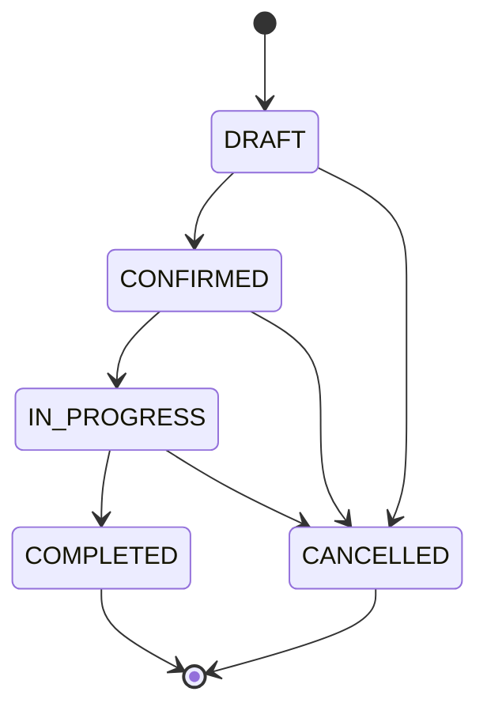

# 📐 00_CANON.md

# Uber's Clap — Source unique de vérité

> Ce document **prime sur tous les autres**.
> En cas de contradiction avec un autre `.md`, c'est celui-ci qui gagne.
> Les autres docs doivent être corrigés pour s'y conformer.

Version : 1.0.0 — 2026-07-22

---

# Pourquoi ce document

Les 28 documents du projet se contredisent sur des points bloquants : nom des
champs, statuts de course, endpoints API, ORM, structure des repos.

Impossible de commencer à coder tant que ce n'est pas tranché.
Ce fichier tranche. Chaque décision a un ADR (Architecture Decision Record)
avec le pourquoi, pour pouvoir revenir dessus en connaissance de cause.

---

# ADR-001 — ORM : Drizzle

**Statut :** Décidé
**Contradictoire avec :** BACKEND_ARCHITECTURE.md (Prisma), DATABASE_SCHEMA.md
(TypeORM/Prisma), PROJECT_STRUCTURE.md (Prisma)

**Décision :** Drizzle ORM.

**Pourquoi :**

- Les écrans les plus critiques (dashboard, stats, rentabilité) sont des
  agrégats SQL. Drizzle donne le contrôle SQL sans fighting l'abstraction.
- Bundle plus léger, pas de moteur binaire à déployer.
- Migrations SQL lisibles et versionnables.

**Conséquence :** corriger les 3 docs listés ci-dessus.

---

# ADR-002 — Monorepo unique

**Statut :** Décidé
**Contradictoire avec :** PROJECT_STRUCTURE.md (5 repos), CODING_GUIDELINES.md
(2 repos)

**Décision :** un seul repository.

```
ubersclap/
├── apps/
│   ├── mobile/          # Expo + React Native
│   └── api/             # NestJS
├── packages/
│   ├── shared/          # types + schémas Zod partagés API <-> mobile
│   └── config/          # eslint, tsconfig, prettier
├── docs/
└── docker-compose.yml
```

Outillage : **pnpm workspaces + Turborepo**.

**Pourquoi :**

- Le vrai gain d'un stack TypeScript full-stack, c'est `packages/shared` :
  un schéma Zod écrit une fois, utilisé pour valider côté API **et** typer
  côté mobile. Impossible avec des repos séparés sans publier un package npm.
- Un dev solo qui synchronise 5 repos passe son temps à synchroniser 5 repos.

**Reporté :** `apps/admin`. Au MVP, un **Metabase** branché en lecture seule sur
la base couvre 100 % du besoin back-office pour 0 € et 0 ligne de code.

**Reporté :** Terraform, Kubernetes. Non nécessaires avant plusieurs milliers
d'utilisateurs. Railway ou Fly.io suffisent.

---

# ADR-003 — Nommage : une seule convention

**Statut :** Décidé
**Contradictoire avec :** API.md (`firstname`), API_DOCUMENTATION.md
(`firstName`), DATABASE.md (`firstname`), DATABASE_SCHEMA.md (`first_name`),
CODING_GUIDELINES.md (dit "camelCase" puis donne un exemple kebab-case)

| Couche              | Convention   | Exemple                |
| ------------------- | ------------ | ---------------------- |
| Colonnes SQL        | `snake_case` | `first_name`           |
| JSON API (in / out) | `camelCase`  | `firstName`            |
| Fichiers TS         | `kebab-case` | `create-course.dto.ts` |
| Classes / Types     | `PascalCase` | `CourseService`        |
| Variables           | `camelCase`  | `courseId`             |
| Constantes          | `UPPER_SNAKE`| `MAX_FILE_SIZE`        |
| Enums (valeurs)     | `UPPER_SNAKE`| `ONE_WAY`              |

La conversion snake ↔ camel se fait **une seule fois**, dans la couche
repository. Jamais dans les controllers, jamais dans le mobile.

---

# ADR-004 — Statuts de course

**Statut :** Décidé
**Contradictoire avec :** DATABASE.md (9 statuts), DATABASE_SCHEMA.md
(5 statuts), MVP_SCOPE.md (5 statuts en français)

**Décision :** 5 statuts, en anglais, `UPPER_SNAKE`.

```
DRAFT        Créée, pas encore engagée
CONFIRMED    Engagée avec le client
IN_PROGRESS  Course en cours (fusionne ON_ROUTE + IN_PROGRESS)
COMPLETED    Terminée, prix final connu
CANCELLED    Annulée
```

Machine à états :



**Pourquoi seulement ceux-là :**

- `PENDING` (attente confirmation client) supprimé : au MVP il n'y a **pas de
  canal client**, personne ne peut confirmer. À réintroduire avec les SMS.
- `ON_ROUTE` supprimé : distinction sans conséquence fonctionnelle au MVP.
- **`INVOICED` et `PAID` supprimés des statuts de course.** C'est le bug de
  conception le plus important de la doc actuelle : l'état de facturation
  n'appartient pas à la course. Une facture peut couvrir 10 courses (voir
  ADR-005). Mettre `INVOICED` sur la course rend la facture groupée impossible.
  → L'état de paiement vit sur `invoices.status`.

---

# ADR-005 — Facturation : 1 facture ↔ N courses

**Statut :** Décidé
**Contradictoire avec :** ARCHITECTURE.md (`COURSE ||--|| INVOICE`),
DATABASE.md (`COURSE ||--o| INVOICE`)

**Décision :** `invoices` + `invoice_lines`. Une facture référence 1..N courses.

**Pourquoi c'est critique :**

Le persona le plus solvable du PRD (Sophie — hôtels, entreprises, événements)
a un besoin structurant : **une facture mensuelle groupée par client
entreprise**. Un hôtel ne veut pas 40 factures de 65 €, il veut une facture de
2 600 € en fin de mois.

Le modèle « 1 course = 1 facture » ferme le segment B2B, qui est justement
celui qui paierait le plus cher l'abonnement. Le corriger après coup implique
de migrer toutes les factures déjà émises — donc des documents comptables
légalement immuables. Coût quasi irréparable.

```
invoices
  id, driver_id, client_id, invoice_number,
  status, issued_at, due_at,
  total_excl_tax_cents, tax_cents, total_incl_tax_cents,
  pdf_url, factur_x_url

invoice_lines
  id, invoice_id, course_id (nullable),
  label, quantity, unit_price_cents, tax_rate
```

---

# ADR-006 — Collision de nom `invoices`

**Statut :** Décidé
**Contradictoire avec :** PAYMENT_AND_BILLING.md

`DATABASE.md` définit `invoices` = factures **client** (le chauffeur facture son
client). `PAYMENT_AND_BILLING.md` définit `invoices` = factures **d'abonnement
Stripe** (nous facturons le chauffeur). Deux entités sans rapport, même nom.

**Décision :**

| Entité                            | Table                   |
| --------------------------------- | ----------------------- |
| Le chauffeur facture son client   | `invoices`              |
| Nous facturons le chauffeur (SaaS)| `subscription_invoices` |

---

# ADR-007 — Isolation multi-tenant

**Statut :** Décidé
**Contradictoire avec :** DATABASE.md (`invoices` n'a pas de `driver_id`)

**Règle absolue :** toute table contenant des données métier porte une colonne
`driver_id` **directe**, même quand elle est déductible par jointure.

**Pourquoi :** une isolation qui dépend d'une jointure est une isolation qu'un
`JOIN` oublié fait sauter. `invoices` sans `driver_id` signifie que lister les
factures d'un chauffeur passe forcément par `courses` — et qu'un bug dans cette
jointure expose les factures d'un autre chauffeur.

Toute requête métier commence par `WHERE driver_id = :currentDriverId`.
À implémenter comme un **guard NestJS + un helper de repository**, jamais
laissé à la discipline du développeur.

---

# ADR-008 — Temps : TIMESTAMPTZ, jamais DATE + TIME

**Statut :** Décidé
**Contradictoire avec :** DATABASE.md (`scheduled_date DATE` + `scheduled_time TIME`)

```sql
scheduled_at   TIMESTAMPTZ NOT NULL
timezone       VARCHAR NOT NULL DEFAULT 'Europe/Paris'
```

**Pourquoi :**

- Un `DATE` + `TIME` sans fuseau est ambigu deux fois par an. Au passage à
  l'heure d'hiver, 02:30 existe deux fois : une course à 02:30 devient
  indécidable.
- Cas métier réel : transferts aéroport avec des vols internationaux, chauffeurs
  qui passent une frontière.
- `timezone` est stocké **en plus** de l'instant, parce que « la course est à
  9h00 heure locale » est l'intention de l'utilisateur, et elle doit survivre à
  un déplacement.

---

# ADR-009 — Argent : entiers en centimes

**Statut :** Décidé
**Contradictoire avec :** DATABASE.md (`decimal` sans précision),
DATABASE_SCHEMA.md (`distance FLOAT`, `amount DECIMAL`)

```sql
estimated_price_cents  INTEGER
final_price_cents      INTEGER
distance_meters        INTEGER
```

**Pourquoi :** un `decimal` non précisé et un `float` produisent des écarts
d'arrondi. Sur un document comptable légalement opposable, un écart d'un centime
est un problème. Les centimes entiers rendent l'arithmétique exacte.

Conversion en euros uniquement à l'affichage, via un helper unique dans
`packages/shared`.

---

# ADR-010 — Contrat API

**Statut :** Décidé
**Contradictoire avec :** API.md et API_DOCUMENTATION.md (qui divergent entre eux)

## Base URL

```
Dev  : http://localhost:3000/v1
Prod : https://api.ubersclap.com/v1
```

Pas de `/api` en plus de `/v1`. Le domaine dit déjà que c'est une API.

## Enveloppe de réponse

L'enveloppe `{success, data}` est **abandonnée**.

**Pourquoi :** elle est déclarée dans les deux docs API puis contredite par
chacun de leurs exemples. Elle duplique une information déjà portée par le
code de statut HTTP, et elle force un `.data` sur chaque appel côté mobile.

```
200 → le corps EST la ressource
201 → le corps EST la ressource créée
4xx/5xx → { "message": string, "code": string, "details"?: unknown }
```

## Endpoints canoniques

Les deux docs API divergent. Voici la liste qui fait foi :

```
POST   /v1/auth/register     → { user, accessToken, refreshToken }
POST   /v1/auth/login        → { user, accessToken, refreshToken }
POST   /v1/auth/refresh      → { accessToken, refreshToken }
POST   /v1/auth/logout       → 204

GET    /v1/me                → profil + profil pro (fusionné, un seul appel)
PATCH  /v1/me

GET    /v1/clients           ?page&limit&search&category
POST   /v1/clients
GET    /v1/clients/:id
PATCH  /v1/clients/:id
DELETE /v1/clients/:id       → soft delete, 204

GET    /v1/courses           ?from&to&status&clientId&page&limit
POST   /v1/courses
GET    /v1/courses/:id
PATCH  /v1/courses/:id
POST   /v1/courses/:id/transitions   { to: "CONFIRMED" }
DELETE /v1/courses/:id       → 204

GET    /v1/invoices          ?status&clientId&from&to
POST   /v1/invoices          { clientId, courseIds: string[] }
GET    /v1/invoices/:id
GET    /v1/invoices/:id/pdf  → 302 vers URL signée, expiration 5 min
POST   /v1/invoices/:id/send
POST   /v1/invoices/:id/credit-note

GET    /v1/dashboard         ?period=day|week|month|year

POST   /v1/ai/parse-course
POST   /v1/ai/assistant
```

Supprimés : `/planning/day|week|month` — c'est `GET /v1/courses?from&to`.
Trois endpoints pour une plage de dates, c'est trois fois le même code.

Supprimé : `/driver/profile` séparé de `/users/me` — deux appels réseau au
démarrage pour afficher un écran. Fusionnés dans `GET /v1/me`.

## Changement de statut

`POST /v1/courses/:id/transitions` et non `PATCH /:id/status`.

**Pourquoi :** un changement de statut n'est pas une mise à jour de champ, c'est
une transition validée par la machine à états (ADR-004). Le serveur refuse
`COMPLETED → DRAFT`. Un `PATCH` suggère qu'on peut écrire n'importe quelle
valeur.

## Idempotence — obligatoire

**Absent des deux docs API. C'est un bug bloquant pour l'usage réel.**

Tout `POST` accepte et **exige** :

```http
Idempotency-Key: <uuid-v7 généré par le mobile>
```

Le serveur stocke la clé 24 h avec la réponse. Une clé déjà vue renvoie la
réponse d'origine sans réexécuter.

**Pourquoi :** le cas d'usage central de l'app est un chauffeur dans un parking
souterrain d'aéroport. Il crée une course, le réseau tombe, le mobile retente.
Sans idempotence, il a deux courses — et plus tard deux factures. Le doc
MOBILE_ARCHITECTURE promet un mode offline sur 5 lignes sans jamais mentionner
ce problème.

---

# ADR-011 — Offline-first, pas offline-bonus

**Statut :** Décidé
**Complète :** MOBILE_ARCHITECTURE.md (qui traite le sujet en 5 lignes)

Règles :

1. **Les IDs sont générés côté mobile** (UUID v7). Le serveur les accepte tels
   quels. Sans ça, impossible de créer une entité hors-ligne et d'y référer.
   UUID v7 plutôt que v4 : ordonné dans le temps, donc les index Postgres ne
   se fragmentent pas.
2. **Toute mutation part dans une file locale persistée** (SQLite), rejouée à la
   reconnexion, avec son `Idempotency-Key`.
3. **Résolution de conflit : last-write-wins par champ**, avec un `updated_at`
   par entité. Suffisant ici — un seul utilisateur écrit ses propres données,
   les conflits réels sont rares (même course éditée sur deux appareils).
4. **Ce qui marche hors-ligne au MVP :** consulter le planning, consulter les
   clients, créer/modifier une course, terminer une course.
   **Ce qui ne marche pas hors-ligne :** autocomplete d'adresse, PDF, IA.
   Ça doit être visible dans l'UI, pas échouer silencieusement.

---

# ADR-012 — Conformité facture France

**Statut :** Décidé — **à faire valider par un expert-comptable**
**Absent de toute la doc actuelle**

⚠️ Cette section engage la responsabilité légale de l'utilisateur.
Rien ici ne remplace un avis professionnel. Les seuils et dates ci-dessous
ont évolué plusieurs fois — **à revérifier avant implémentation**.

## Numérotation

- Chronologique, continue, **sans trou**.
- Format : `AAAA-NNNNN` (ex. `2026-00042`), séquence par chauffeur et par année.
- Attribution **en base, dans une transaction**, au moment de l'émission —
  jamais côté client, jamais avec un compteur applicatif en mémoire.
- Un numéro attribué n'est jamais réutilisé, même si l'émission échoue ensuite.

## TVA

- Transport de personnes en France : **taux réduit 10 %** (pas 20 %).
- Chauffeur en franchise en base : **0 %** + mention obligatoire
  `TVA non applicable, art. 293 B du CGI`.
- → Le profil chauffeur doit porter un champ `vat_regime`
  (`FRANCHISE` | `NORMAL`) qui pilote le calcul et les mentions.
  **Générer une facture avec TVA pour un micro-entrepreneur en franchise
  produit une facture fausse.**

## Mentions obligatoires (à générer, pas à saisir)

Émetteur : dénomination, forme juridique, adresse, SIRET, n° TVA intra si
assujetti, **n° d'inscription au registre VTC**.
Facture : numéro, date d'émission, date d'échéance, désignation de la
prestation, prix HT, taux et montant de TVA, total TTC.
B2B : pénalités de retard + **indemnité forfaitaire de recouvrement de 40 €**.

→ Ajouter au profil chauffeur : `legal_form`, `vat_number`,
`vtc_registration_number`, `vat_regime`. Absents des deux schémas actuels.

## Immuabilité

Une facture émise ne se modifie **jamais**. Correction = **avoir**
(`credit_notes`). Absent des deux schémas actuels.

## Facturation électronique

La réforme française impose la réception de factures électroniques pour les
entreprises assujetties à la TVA, avec une obligation d'émission qui se
déploie ensuite par taille d'entreprise. Un chauffeur qui facture des
entreprises sera concerné.

**Recommandation :** générer du **Factur-X** dès le premier PDF —
un PDF/A-3 avec le XML CII embarqué. C'est le même PDF, avec des métadonnées
en plus. Le surcoût au démarrage est marginal ; le refactor a posteriori
touche tous les documents déjà émis.

⚠️ **Le calendrier de cette réforme a été reporté plusieurs fois.
Vérifie les échéances en vigueur avant de planifier.**

## Conservation

Pièces comptables : **10 ans**.

→ Conflit direct avec le « droit à la suppression » décrit dans SECURITY.md.
**Résolution :** la suppression de compte anonymise les données personnelles
(nom, email, téléphone) mais **conserve les factures** avec leurs montants et
numéros, au titre de l'obligation légale de conservation. À écrire noir sur
blanc dans les CGU et la politique de confidentialité.

---

# ADR-013 — RGPD : nous sommes sous-traitant

**Statut :** Décidé
**Absent de SECURITY.md et SECURITY_ARCHITECTURE.md**

Les deux docs sécurité traitent le RGPD comme si le chauffeur était le seul
concerné. Il manque la relation la plus importante :

- Le chauffeur est **responsable de traitement** pour les données de ses clients.
- Nous sommes **sous-traitant** au sens de l'article 28.

**Conséquences concrètes :**

1. Un **contrat de sous-traitance (DPA)** doit figurer dans les CGU.
2. Un **registre des traitements** doit exister.
3. Les sous-traitants ultérieurs (hébergeur, Stripe, fournisseur SMS, fournisseur
   IA) doivent être **listés nommément** et acceptés.

**Import de contacts :** importer le carnet d'adresses entier serait une
collecte massive de données de tiers qui n'ont jamais consenti.
FEATURES.md prévoit déjà une sélection contact par contact — **c'est le bon
choix, le garder**. Corollaire technique : **ne jamais uploader le carnet
complet au serveur**, même temporairement, même pour du matching.

---

# ADR-014 — Périmètre MVP (tranche les 4 versions contradictoires)

**Statut :** Décidé
**Contradictoire avec :** README.md, MVP_SCOPE.md, ROADMAP.md, PRD

## Dans le MVP

```
Auth (email + mot de passe)
Profil chauffeur complet (incl. champs légaux d'ADR-012)
Clients — CRUD + recherche
Courses — CRUD + machine à états
Planning — vue jour + vue semaine
Dépenses — saisie simple
Facturation — PDF conforme + numérotation
Dashboard — CA, courses, km, dépenses, bénéfice
Offline — consultation + création de course
```

## Hors MVP

```
Signature numérique        ← README disait "dans le MVP", ROADMAP phase 7,
                             MVP_SCOPE "reportée", PRD "P1". Tranché : hors.
SMS / emails automatiques
IA
Multi-véhicules, multi-chauffeurs
Import de contacts
Google Calendar
Marketplace, connexion Uber/Bolt
```

## Pourquoi les dépenses passent DANS le MVP

MVP_SCOPE.md les exclut. Mais MVP_SCOPE.md, USER_FLOW.md et
ANALYTICS_SYSTEM.md affichent tous les trois un **bénéfice** au dashboard.

`Bénéfice = Revenus − Dépenses`. Sans les dépenses, le bénéfice est faux, et
c'est précisément le chiffre qui justifie l'abonnement. Une saisie simple
(montant, catégorie, date, photo du ticket) coûte deux jours de dev.

## Pourquoi la signature sort du MVP

C'est une preuve de prestation, utile en cas de litige. Un litige suppose
d'avoir déjà des clients et du volume. Aucun chauffeur ne choisira l'app pour
la signature, alors que beaucoup la choisiront pour la facture.

---

# ADR-015 — Tarification

**Statut :** Proposé — décision business à confirmer
**Contradictoire avec :** MONETIZATION.md et PAYMENT_AND_BILLING.md (9,99 €)

## Problème du modèle actuel

**Marge négative possible.** Premium à 9,99 € inclut « SMS rappel » et des
crédits IA — deux **coûts variables réels**. À ~0,08 €/SMS en France, un
chauffeur qui envoie 100 SMS/mois consomme 8 € sur 9,99 € de revenu, avant
même l'IA, l'hébergement et la TVA.

**Free mal calibré.** 50 courses/mois pour un chauffeur qui en fait 150 à 450 :
le free s'épuise en 4 jours, avant que l'habitude ne se crée.

**Prix sous-positionné.** Sur un marché B2B professionnel, un prix bas ne
convertit pas mieux — il signale un outil amateur. Les concurrents cités dans
COMPETITIVE_ANALYSIS.md (Indy, Henrri) sont plus chers.

## Proposition

| Plan     | Prix         | Contenu                                                   |
| -------- | ------------ | --------------------------------------------------------- |
| Free     | 0 €          | Clients + courses + planning **illimités**, **3 factures/mois** |
| Pro      | 16,99 €/mois | Tout illimité, dépenses, dashboard, **50 SMS inclus**      |
| Business | 39,99 €/mois | Multi-chauffeurs, planning partagé, stats équipe           |

Annuel : 2 mois offerts.

**Pourquoi ce découpage :** le mur est sur la **facture**, pas sur la course.
Le chauffeur utilise l'app gratuitement tous les jours, prend l'habitude, puis
se heurte à la limite au moment exact où il perçoit la valeur — quand il doit
facturer. C'est le meilleur moment de conversion possible.

Les SMS deviennent un quota explicite, ce qui rend la marge prévisible.

---

# ADR-016 — Le nom du produit

**Statut :** ⚠️ **Ouvert — à trancher avant tout investissement en identité**

« Uber's Clap » contient « Uber », marque déposée et activement défendue, sur un
produit qui cible explicitement les chauffeurs Uber, destiné à l'App Store et au
Play Store.

**Risques :** retrait par Apple ou Google au moment de la revue, mise en demeure,
perte du nom de domaine et de toute l'identité visuelle construite dessus.

**Pourquoi c'est ici et pas en note de bas de page :** le coût de ce changement
croît très vite. Aujourd'hui il est nul. Après le logo, la DA, le domaine, les
comptes stores et les premiers utilisateurs, il est très élevé.

**Action recommandée :** trancher le nom **avant** de commander la direction
artistique.

---

# Table de restructuration des documents

28 fichiers → 16. Les fusions résolvent les contradictions listées ci-dessus.

| Nouveau                    | Fusionne                                          |
| -------------------------- | ------------------------------------------------- |
| `00_CANON.md`              | (ce fichier)                                      |
| `README.md`                | README (nettoyé, roadmap retirée)                 |
| `docs/product/PRD.md`      | PRD + BUSINESS + FEATURES + MVP_SCOPE             |
| `docs/product/ROADMAP.md`  | ROADMAP (aligné sur ADR-014)                      |
| `docs/product/MARKET.md`   | COMPETITIVE_ANALYSIS                              |
| `docs/product/PRICING.md`  | MONETIZATION + PAYMENT_AND_BILLING (partie plans) |
| `docs/design/UI_UX.md`     | ⚠️ **manquant** — référencé par README            |
| `docs/design/DESIGN_DIRECTION.md` | ⚠️ **manquant**                            |
| `docs/design/USER_FLOW.md` | USER_FLOW                                         |
| `docs/tech/ARCHITECTURE.md`| ARCHITECTURE + BACKEND_ARCHITECTURE               |
| `docs/tech/MOBILE.md`      | MOBILE_ARCHITECTURE                               |
| `docs/tech/DATABASE.md`    | DATABASE + DATABASE_SCHEMA ⚠️ **incompatibles**   |
| `docs/tech/API.md`         | API + API_DOCUMENTATION ⚠️ **incompatibles**      |
| `docs/tech/SECURITY.md`    | SECURITY + SECURITY_ARCHITECTURE                  |
| `docs/tech/INTEGRATIONS.md`| INTEGRATIONS + NOTIFICATIONS + ANALYTICS + AI     |
| `docs/tech/DEPLOYMENT.md`  | DEPLOYMENT + TESTING                              |
| `docs/CONTRIBUTING.md`     | CODING_GUIDELINES + PROJECT_STRUCTURE             |
| `docs/legal/COMPLIANCE.md` | ⚠️ **manquant** — facture FR, RGPD, DPA           |

---

# Ordre d'attaque recommandé

1. Trancher **ADR-016** (le nom). Bloque la DA.
2. Faire valider **ADR-012** par un expert-comptable. Bloque la facturation.
3. Écrire le schéma Drizzle en appliquant ADR-004 → ADR-009.
4. Générer les types depuis le schéma vers `packages/shared`.
5. Coder l'API dans l'ordre : auth → clients → courses → factures.
6. Coder le mobile écran par écran, offline dès le premier jour (ADR-011) —
   le rajouter après implique de réécrire toute la couche données.
