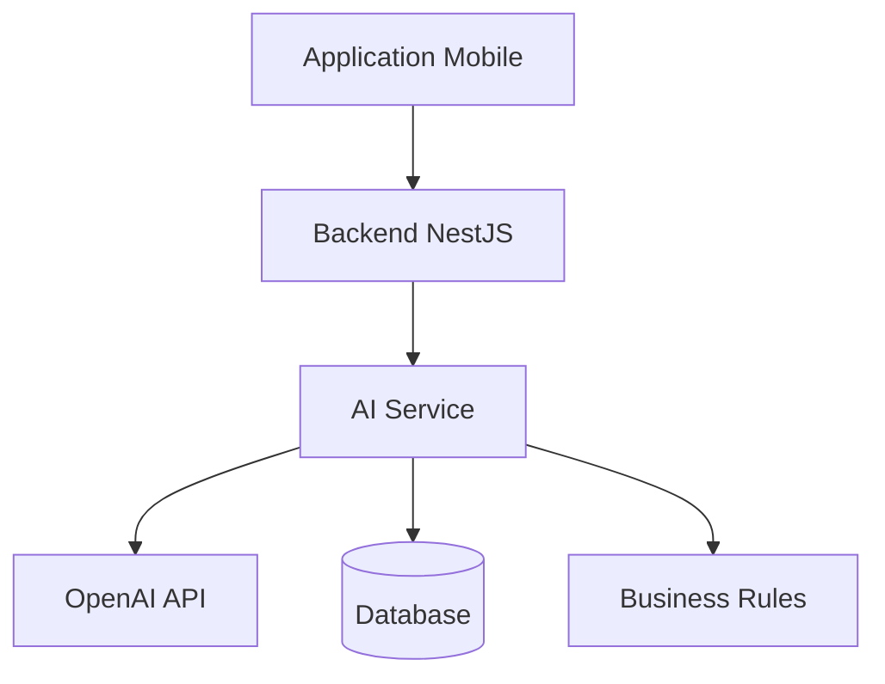

# 🤖 AI.md

# Uber's Clap

> Documentation Intelligence Artificielle

Version : 0.1.0

---

# 📖 Introduction

L'intelligence artificielle est un élément différenciant d'Uber's Clap.

L'objectif n'est pas de remplacer le chauffeur, mais de devenir un assistant métier capable de réduire les tâches administratives.

L'IA doit permettre au chauffeur de :

- gagner du temps
- éviter les oublis
- mieux comprendre son activité
- optimiser ses revenus

---

# 🎯 Objectifs IA

Les objectifs principaux :

- Automatiser la création de courses
- Faciliter la gestion quotidienne
- Analyser l'activité professionnelle
- Donner des recommandations
- Simplifier la communication client

---

# 🧠 Architecture IA



---

# 🔒 Principe important

L'IA ne doit jamais modifier une donnée importante sans validation utilisateur.

Exemple :

L'IA peut proposer :

"J'ai détecté une nouvelle course."

Mais le chauffeur doit confirmer :

"Créer la course."

---

# 🧩 MODULE IA 1 — Création automatique de course

## Objectif

Permettre au chauffeur de créer une course simplement depuis un message.

---

# Exemple utilisateur

Le chauffeur écrit :

```
Demain 15h récupérer Monsieur Dupont à CDG
destination hôtel Hilton Paris
prix 80€
```

---

# Analyse IA

Extraction :

```json
{
  "client": "Monsieur Dupont",
  "date": "2026-07-23",
  "time": "15:00",
  "pickup": "CDG",
  "destination": "Hilton Paris",
  "price": 80
}
```

---

# Résultat

L'application propose :

```
Nouvelle course détectée

Client :
Monsieur Dupont

Départ :
CDG

Destination :
Hilton Paris

Horaire :
15h00

Prix :
80€

Créer la course ?
```

---

# 🧩 MODULE IA 2 — Assistant conversationnel

## Objectif

Permettre au chauffeur de poser des questions sur son activité.

---

# Exemples

Utilisateur :

"Combien ai-je gagné cette semaine ?"

Réponse :

"Vous avez réalisé 42 courses pour un chiffre d'affaires de 2450€."

---

Utilisateur :

"Quel est mon meilleur client ?"

Réponse :

"Votre meilleur client est Jean Dupont avec 850€ générés."

---

Utilisateur :

"Combien me coûte ma voiture par mois ?"

Réponse :

"Vos dépenses véhicule moyennes sont de 430€/mois."

---

# Architecture

L'IA utilise :

- données utilisateur autorisées
- statistiques calculées
- historique courses

---

# 🧩 MODULE IA 3 — Analyse financière

## Objectif

Transformer les données en conseils.

---

# Analyses possibles

## Rentabilité

Exemple :

"Votre marge moyenne est de 62%."

---

## Dépenses

Exemple :

"Votre carburant représente 18% de vos dépenses."

---

## Comparaison

Exemple :

"Vos revenus sont supérieurs de 12% au mois dernier."

---

# 🧩 MODULE IA 4 — Optimisation planning

## Objectif

Aider le chauffeur à mieux organiser ses journées.

---

# Détection

L'IA analyse :

- distances
- horaires
- zones
- historique

---

# Suggestions

Exemple :

"Vous avez une course à 18h à Paris. Évitez d'accepter une prise en charge à Versailles entre 17h et 18h."

---

# 🧩 MODULE IA 5 — Suggestion de prix

## Objectif

Aider le chauffeur à définir un tarif.

---

Données utilisées :

- distance
- durée
- carburant
- péage
- historique client
- horaire

---

Exemple :

```
Prix conseillé :

120€

Minimum rentable :

95€

Prix habituel :

130€
```

---

# 🧩 MODULE IA 6 — Communication client

## Objectif

Créer automatiquement des messages professionnels.

---

# Exemple

Demande :

"Préviens mon client du retard."

---

Réponse :

```
Bonjour Monsieur Dupont,

Votre chauffeur aura environ 10 minutes de retard suite aux conditions de circulation.

Merci de votre compréhension.
```

---

# 🧩 MODULE IA 7 — Résumé automatique

## Objectif

Créer un résumé quotidien.

---

Chaque soir :

```
Résumé du 22 juillet

Courses :
8

Distance :
320 km

CA :
480€

Dépenses :
75€

Bénéfice estimé :
405€

Meilleur client :
Entreprise X
```

---

# 🧩 MODULE IA 8 — Détection d'oublis

## Objectif

Éviter les erreurs administratives.

---

Exemples :

"Vous avez terminé une course hier mais aucune facture n'a été créée."

---

"Votre client Martin possède 5 courses non facturées."

---

# 💰 Gestion des coûts IA

L'utilisation IA représente un coût.

---

# Solution

Système de crédits.

---

Exemple :

Premium :

100 actions IA/mois

---

Actions supplémentaires :

achat de crédits.

---

# 🔐 Sécurité IA

Règles :

- Ne jamais envoyer toutes les données utilisateur inutilement.
- Anonymiser les informations sensibles si possible.
- Contrôler les permissions.
- Garder un historique des requêtes.

---

# Stockage historique IA

Table :

```
ai_requests
```

Contient :

- utilisateur
- demande
- réponse
- modèle utilisé
- date

---

# Modèles possibles

## MVP

OpenAI API.

---

## Future

Possibilité d'ajouter :

- modèles open source
- modèles spécialisés transport
- modèles locaux

---

# 🛣️ Roadmap IA

---

# Version 1

Assistant simple :

- questions activité
- résumé journée

---

# Version 2

Automatisation :

- création courses
- messages clients
- rappels intelligents

---

# Version 3

Optimisation avancée :

- prédiction revenus
- optimisation planning
- recommandations personnalisées

---

# Version 4

Assistant complet :

Un véritable copilote du chauffeur.

---

# Conclusion

L'IA dans Uber's Clap doit devenir un véritable assistant professionnel.

Elle ne remplace pas le chauffeur.

Elle réduit l'administratif et permet au professionnel de prendre de meilleures décisions grâce à ses propres données.
