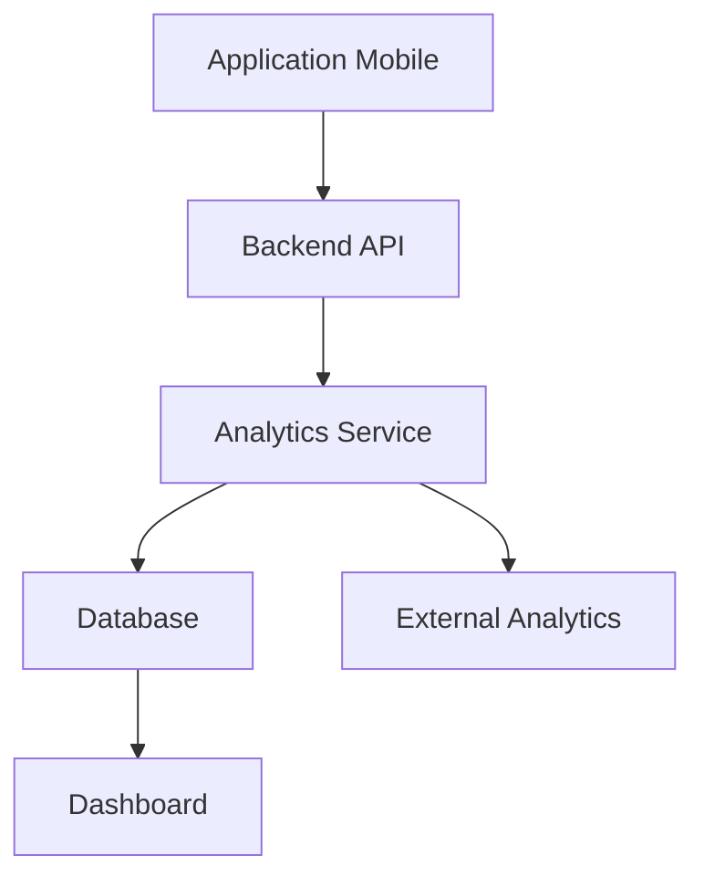

# 📊 ANALYTICS_SYSTEM.md

# Uber's Clap

> Système d'analytics et de statistiques

Version : 0.1.0

---

# 📖 Introduction

Les analytics permettent de comprendre :

- l'activité des chauffeurs
- l'utilisation de l'application
- la performance du produit
- les opportunités d'amélioration

L'objectif est de transformer les données en décisions utiles.

---

# 🎯 Objectifs

Le système doit permettre :

- au chauffeur de suivre son activité
- à l'équipe produit d'améliorer l'application
- au business de suivre la croissance

---

# 🏗️ Architecture Analytics



---

# 📊 Types d'analytics

Le système est divisé en 3 catégories :

---

# 1. Analytics métier chauffeur

Données visibles par l'utilisateur.

---

# 2. Analytics produit

Données internes application.

---

# 3. Analytics business

Données SaaS.

---

# 🚗 Analytics chauffeur

## Objectif

Permettre au chauffeur de comprendre sa rentabilité.

---

# Dashboard quotidien

Afficher :

- nombre courses
- chiffre d'affaires
- distance
- durée travail
- dépenses
- bénéfice

---

Exemple :

```
Aujourd'hui

Courses :
8

CA :
620€

Distance :
245 km

Carburant :
70€

Bénéfice :
550€

```

---

# 📅 Analyse période

Filtres :

- jour
- semaine
- mois
- année

---

Afficher :

- évolution revenus
- nombre courses
- comparaison période précédente

---

# 👥 Analyse clients

Statistiques :

- meilleur client
- fréquence réservation
- revenu généré
- dernière course

---

Exemple :

```
Jean Dupont

15 courses

1250€ générés

Client depuis 8 mois
```

---

# 🚘 Analyse véhicule

(Future version)

---

Données :

- kilomètres
- coût entretien
- consommation
- rentabilité véhicule

---

# 💰 Analyse financière

---

Calcul :

```
Bénéfice = Revenus - Dépenses
```

---

Dépenses :

- carburant
- péages
- parking
- entretien
- assurance

---

# 📱 Analytics produit

## Objectif

Comprendre comment l'application est utilisée.

---

# Événements utilisateurs

Chaque action importante génère un événement.

---

Exemples :

```
USER_REGISTERED

LOGIN_SUCCESS

CLIENT_CREATED

COURSE_CREATED

INVOICE_GENERATED

SUBSCRIPTION_STARTED

```

---

# Structure événement

```json
{
  "name": "COURSE_CREATED",

  "userId": "uuid",

  "properties": {
    "type": "AIRPORT",

    "price": 120
  },

  "timestamp": "2026-07-22"
}
```

---

# 📌 Événements MVP

---

# Auth

```
APP_OPENED

USER_REGISTERED

USER_LOGIN

```

---

# Clients

```
CLIENT_CREATED

CLIENT_UPDATED

CLIENT_DELETED

```

---

# Courses

```
COURSE_CREATED

COURSE_COMPLETED

COURSE_CANCELLED

```

---

# Facturation

```
INVOICE_CREATED

INVOICE_SENT

```

---

# Abonnement

```
PREMIUM_STARTED

SUBSCRIPTION_CANCELLED

```

---

# 📈 KPI Produit

---

# Activation

Mesurer :

Combien d'utilisateurs réalisent :

- inscription
- premier client
- première course

---

# Exemple :

```
100 inscriptions

↓

80 profils complétés

↓

65 premières courses

```

---

# Engagement

Mesurer :

- utilisateurs actifs
- fréquence utilisation
- nombre courses créées

---

# Rétention

Mesurer :

Utilisateurs revenant après :

- 1 jour
- 7 jours
- 30 jours

---

# Conversion

Mesurer :

Free → Premium

---

Exemple :

```
1000 utilisateurs Free

↓

100 Premium

=

10% conversion

```

---

# 💼 Analytics Business SaaS

---

# Revenus

Suivre :

- MRR
- ARR
- revenu moyen utilisateur

---

# MRR

Monthly Recurring Revenue

```
Nombre abonnés × prix abonnement
```

---

# ARR

Annual Recurring Revenue

```
MRR × 12
```

---

# Churn

Nombre utilisateurs perdus.

---

# LTV

Valeur moyenne utilisateur.

---

# CAC

Coût acquisition client.

---

# 🛠️ Outils possibles

---

# Produit

Solutions :

- PostHog
- Mixpanel
- Amplitude

---

# Erreurs

- Sentry

---

# Business

- Stripe Dashboard
- Metabase

---

# 📊 Dashboard interne

Créer un dashboard administrateur.

---

Afficher :

## Utilisateurs

- nouveaux comptes
- actifs
- abonnements

---

## Activité

- courses/jour
- factures générées
- documents créés

---

## Technique

- erreurs
- performances API
- crash mobile

---

# 🔐 Confidentialité RGPD

Les analytics doivent respecter :

- minimisation données
- anonymisation
- consentement utilisateur
- suppression possible

---

# 🚀 Évolutions IA

L'analytics pourra alimenter :

- recommandations personnalisées
- prédiction revenus
- optimisation planning
- détection habitudes

---

# Conclusion

Le système analytics permet de transformer Uber's Clap en une plateforme pilotée par la donnée.

Les statistiques ne servent pas uniquement à mesurer l'activité, mais à aider le chauffeur à prendre de meilleures décisions et à améliorer continuellement l'application.
