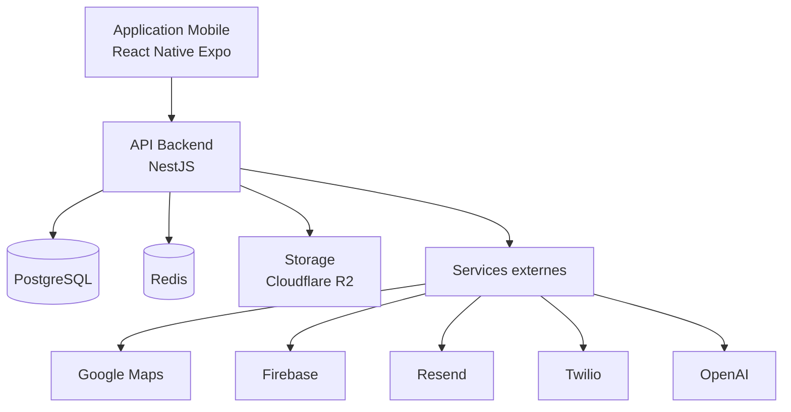
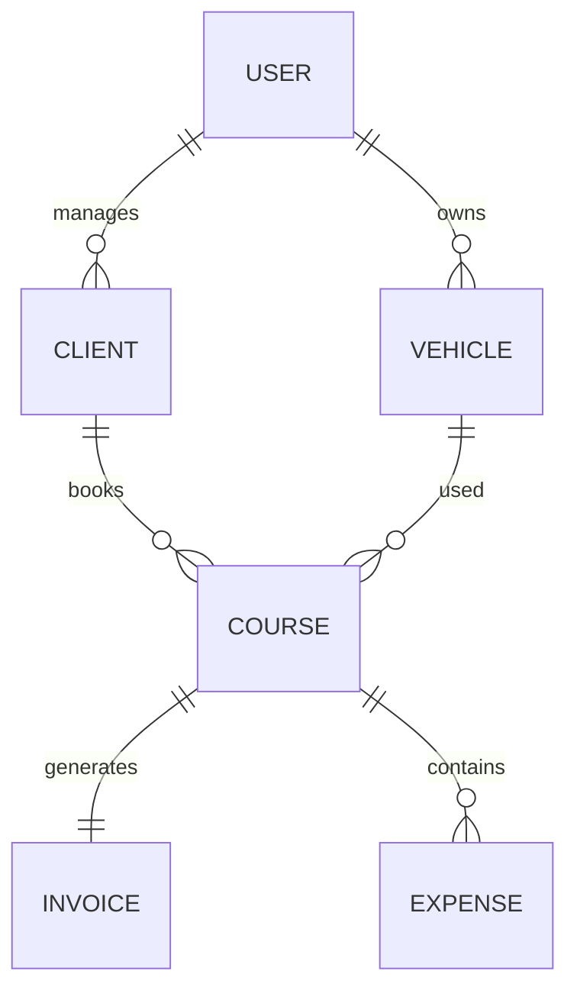
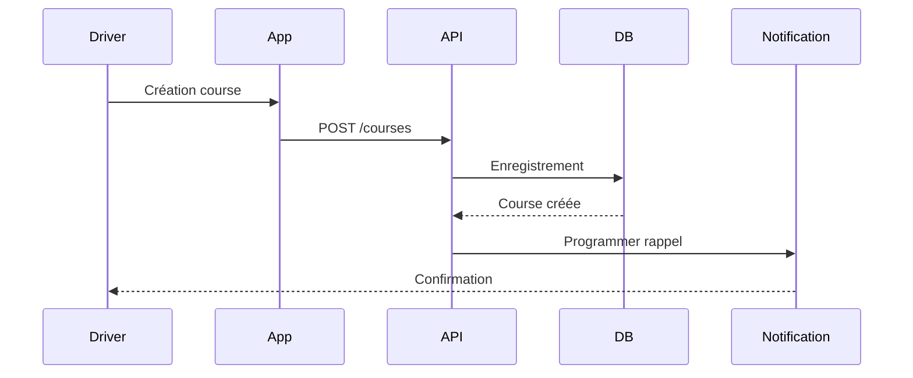
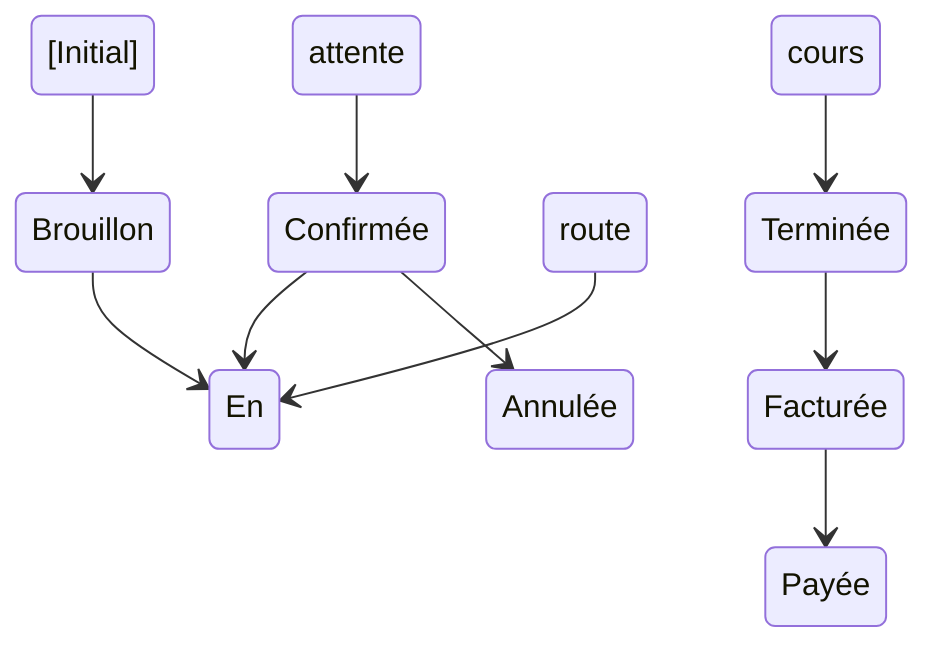
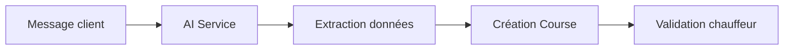

# 🏗️ ARCHITECTURE.md

# Uber's Clap

> Documentation architecture logicielle

Version : 0.1.0

---

# 📖 Introduction

Uber's Clap est une application mobile SaaS construite autour d'une architecture moderne séparant :

- Application mobile
- API backend
- Base de données
- Services externes
- Workers d'automatisation

L'objectif est d'obtenir une architecture :

- scalable
- maintenable
- sécurisée
- facilement évolutive

---

# 🌐 Architecture globale



---

# 📱 Application Mobile

## Technologie

- React Native
- Expo
- TypeScript

---

# Responsabilités

L'application mobile gère :

- interface utilisateur
- navigation
- formulaires
- stockage local
- notifications
- GPS
- signature client

---

# Architecture mobile

Organisation recommandée :

```
src

├── app

├── screens

├── components

├── hooks

├── services

├── store

├── types

├── utils

└── assets

```

---

# Structure détaillée

## app

Gestion :

- navigation
- providers
- configuration globale

---

## screens

Chaque écran utilisateur.

Exemple :

```
screens

├── Login

├── Dashboard

├── Planning

├── Clients

├── Courses

├── Invoice

└── Settings

```

---

## components

Composants réutilisables.

Exemple :

- Button
- Card
- Input
- Modal
- Calendar
- CourseCard

---

## services

Communication backend.

Exemple :

```
services

├── api.ts

├── client.service.ts

├── course.service.ts

└── invoice.service.ts
```

---

# 🔥 Backend

## Technologie

NestJS

---

# Responsabilités

Le backend gère :

- logique métier
- authentification
- permissions
- données
- génération documents
- automatisations

---

# Architecture backend

```
src

├── auth

├── users

├── clients

├── courses

├── planning

├── invoices

├── expenses

├── vehicles

├── notifications

├── statistics

├── ai

├── storage

└── common

```

---

# Modules métier

---

# Auth Module

Gestion :

- inscription
- connexion
- tokens
- permissions

---

# Users Module

Gestion :

- profil chauffeur
- paramètres
- préférences

---

# Clients Module

Gestion CRM.

Responsabilités :

- création client
- modification
- recherche
- historique

---

# Courses Module

Module principal.

Responsabilités :

- création course
- modification
- changement statut
- calcul prix
- historique

---

# Planning Module

Responsabilités :

- calendrier
- disponibilité
- conflits horaires

---

# Invoice Module

Responsabilités :

- génération facture
- PDF
- statut paiement

---

# Expense Module

Gestion :

- carburant
- entretien
- péages
- dépenses diverses

---

# Vehicle Module

Gestion :

- véhicules
- maintenance
- kilométrage

---

# Notification Module

Gestion :

- push notifications
- SMS
- emails

---

# Statistics Module

Calcul :

- CA
- bénéfices
- performances

---

# AI Module

Assistant intelligent.

Responsabilités :

- analyse texte
- création automatique
- recommandations

---

# 🗄️ Couche données

## PostgreSQL

Stockage principal.

---

Relations principales :



---

# 🔄 Flux principal : création d'une course



---

# 🔄 Cycle de vie d'une course



---

# 🤖 Architecture IA



---

# ⚙️ Jobs asynchrones

Certaines tâches ne doivent pas bloquer l'utilisateur.

Exemples :

- envoyer SMS
- créer PDF
- envoyer email
- calcul statistiques

Architecture :

```
API

↓

Redis Queue

↓

BullMQ Worker

↓

Action
```

---

# 📄 Gestion documents

Documents stockés dans :

Cloudflare R2

Exemples :

- factures PDF
- signatures
- justificatifs

Flux :

```
Course terminée

↓

Génération PDF

↓

Upload Storage

↓

Lien sécurisé

↓

Client
```

---

# 🔐 Sécurité architecture

Principes :

- aucune donnée sensible côté mobile
- validation serveur obligatoire
- tokens sécurisés
- permissions par utilisateur
- logs d'activité

---

# 📈 Scalabilité future

L'architecture permet :

## Version entreprise

Ajout :

- organisations
- équipes
- rôles

---

## Multi chauffeurs

Ajout :

- dispatcher
- planning partagé
- attribution automatique

---

## Microservices futurs

Possible séparation :

- Notification Service
- AI Service
- Billing Service

Mais uniquement lorsque nécessaire.

---

# 🚫 Choix volontairement évités

## Microservices dès le début

Non recommandé.

Pourquoi :

- complexité inutile
- coût supérieur
- maintenance plus difficile

---

## GraphQL

Non nécessaire.

REST suffit pour ce type d'application.

---

## Serverless complet

Non adapté au besoin métier.

---

# ✅ Conclusion

L'architecture Uber's Clap est pensée pour commencer comme un MVP mobile simple tout en gardant une base capable d'évoluer vers un SaaS professionnel utilisé par plusieurs milliers de chauffeurs.
