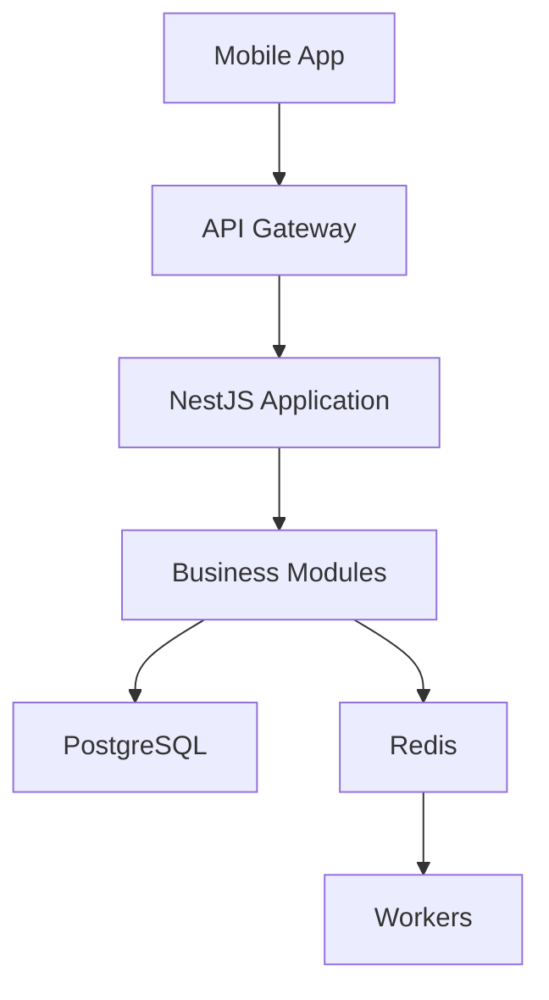

# 🖥️ BACKEND_ARCHITECTURE.md

# Uber's Clap

> Architecture Backend

Version : 0.1.0

---

# 📖 Introduction

Le backend Uber's Clap est le cœur métier de l'application.

Il gère :

- authentification
- utilisateurs
- chauffeurs
- clients
- courses
- planning
- facturation
- notifications
- statistiques
- IA

---

# 🎯 Objectifs architecture

Le backend doit être :

✅ Maintenable

✅ Sécurisé

✅ Scalable

✅ Testable

✅ Facile à faire évoluer

---

# 🏗️ Stack Backend recommandée

---

# Framework

```
NestJS
```

---

# Langage

```
TypeScript
```

---

# Base de données

```
PostgreSQL
```

---

# ORM

Recommandation :

```
Prisma
```

Alternative :

```
TypeORM
```

---

# Cache

```
Redis
```

---

# Queue système

```
BullMQ
```

---

# Documentation API

```
Swagger OpenAPI
```

---

# Architecture globale



---

# 📂 Structure projet

Architecture modulaire :

```
backend/

├── src/

│
├── auth/

│   ├── auth.controller.ts

│   ├── auth.service.ts

│   ├── auth.module.ts

│
├── users/

├── drivers/

├── clients/

├── courses/

├── invoices/

├── expenses/

├── notifications/

├── analytics/

├── ai/

│
├── common/

├── database/

├── config/

└── main.ts

```

---

# 🧩 Architecture par module

Chaque module contient :

```
module/

├── controller

├── service

├── repository

├── dto

├── entities

├── tests

```

---

# Exemple Course Module

```
courses/

├── courses.controller.ts

├── courses.service.ts

├── courses.repository.ts

├── dto/

│   ├── create-course.dto.ts

│   └── update-course.dto.ts

```

---

# 🎯 Responsabilités couches

---

# Controller

Responsable :

- recevoir requêtes HTTP
- validation entrée
- retourner réponse

---

Exemple :

```
POST /courses
```

---

# Service

Responsable :

- logique métier
- règles application

---

Exemple :

```
Créer une course

Vérifier disponibilité

Calculer prix

Sauvegarder

```

---

# Repository

Responsable :

- accès données
- requêtes base

---

# DTO

Responsable :

- validation données entrantes

---

# 🔐 Module Auth

Gestion :

- inscription
- connexion
- JWT
- refresh token
- permissions

---

Architecture :

```
AuthController

↓

AuthService

↓

UserRepository

↓

Database

```

---

# 🛡️ Guards & Middleware

---

# Auth Guard

Vérifie :

```
Token JWT valide
```

---

# Roles Guard

Vérifie :

```
DRIVER

ADMIN

MANAGER
```

---

# Middleware

Utilisation :

- logs
- tracking
- sécurité

---

# 📅 Course Module

Module principal.

---

Responsabilités :

- création course
- modification
- statuts
- historique
- calculs

---

Workflow :

```
Create Course

↓

Validation

↓

Save Database

↓

Notification

↓

Analytics Event

```

---

# 👥 Client Module

Gestion :

- CRUD clients
- recherche
- historique courses

---

Optimisations :

- recherche téléphone
- recherche nom
- pagination

---

# 🧾 Invoice Module

Gestion :

- génération facture
- numérotation
- PDF
- envoi

---

Process :

```
Course Completed

↓

Invoice Service

↓

PDF Generator

↓

Storage

↓

Client

```

---

# 🔔 Notification Module

Responsabilités :

- push
- email
- SMS
- rappels automatiques

---

Technologies :

- BullMQ
- Redis

---

Exemple :

```
Course à 15h

↓

Job créé

↓

Worker exécute

↓

Notification envoyée

```

---

# 📊 Analytics Module

Collecte :

- événements
- statistiques
- KPI

---

Exemple :

```
COURSE_CREATED

↓

Analytics Service

↓

Database

```

---

# 🤖 AI Module

Responsabilités :

- appels modèles IA
- traitement prompts
- analyse données

---

Fonctions :

- création course naturelle
- assistant financier
- recommandations

---

# ⚙️ Background Jobs

Certaines tâches ne doivent pas bloquer l'API.

---

Utilisation :

```
BullMQ
```

---

Exemples :

---

Génération PDF :

```
API

↓

Queue

↓

Worker

↓

PDF

```

---

Notifications :

```
Scheduler

↓

Queue

↓

Worker

```

---

# 🕒 Cron Jobs

Tâches planifiées :

---

Tous les jours :

```
Analyser activité chauffeur
```

---

Toutes les heures :

```
Vérifier rappels courses
```

---

Chaque semaine :

```
Rapport performance
```

---

# 🌐 API Layer

Organisation :

```
/api/v1
```

---

Exemple :

```
GET

/api/v1/courses
```

---

# Validation

Utiliser :

- Zod
- class-validator

---

Chaque requête doit être validée.

---

# 🗄️ Database Layer

Gestion :

- migrations
- relations
- transactions

---

Exemple :

Création course :

Transaction :

```
Create Course

+

Update Client History

+

Create Notification

```

---

# 🔄 Event Driven Architecture

Prévoir un système événementiel.

---

Exemple :

Course terminée :

```
COURSE_COMPLETED

↓

Invoice Service

↓

Analytics Service

↓

Notification Service

```

---

# 🧪 Tests Backend

---

Unit Tests :

```
Jest
```

---

Integration :

```
Supertest
```

---

E2E :

```
API Testing
```

---

# 📦 Configuration

Variables environnement :

```
.env

```

---

Exemple :

```
DATABASE_URL=

JWT_SECRET=

REDIS_URL=

STRIPE_KEY=

OPENAI_KEY=

```

---

# 🚀 Scalabilité

Préparation future :

---

# API Scaling

Plusieurs instances :

```
Load Balancer

↓

API Servers

```

---

# Database

Optimisations :

- index
- réplication
- cache

---

# Workers séparés

Séparer :

```
API

Worker

Scheduler

```

---

# 🔐 Sécurité backend

Mesures :

- Helmet
- Rate limit
- Validation DTO
- Logs sécurisés
- Secrets management

---

# 📊 Monitoring

Solutions :

- Sentry
- Grafana
- Prometheus
- Datadog

---

Surveiller :

- erreurs
- temps réponse
- CPU
- mémoire

---

# 🚀 Évolution architecture

---

# Phase MVP

Architecture monolithique modulaire.

```
One Backend

+
One Database

```

---

# Phase croissance

Séparer :

- notification service
- IA service
- analytics service

---

# Phase Enterprise

Architecture :

```
Microservices

Event Bus

Kubernetes

```

---

# Conclusion

L'architecture backend Uber's Clap privilégie une approche modulaire.

Le choix NestJS permet de construire rapidement un backend professionnel tout en conservant une capacité d'évolution vers une architecture SaaS à grande échelle.
