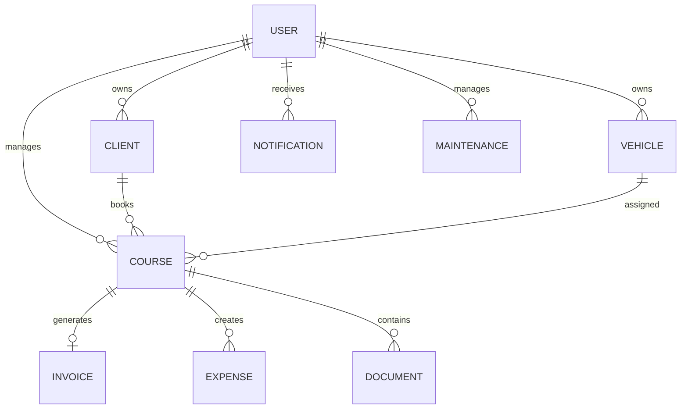

# 🗄️ DATABASE.md

# Uber's Clap

> Documentation base de données

Version : 0.1.0

---

# 📖 Introduction

Uber's Clap utilise PostgreSQL comme base de données principale.

Le modèle est conçu pour représenter l'activité complète d'un chauffeur VTC :

- son compte professionnel
- ses clients
- ses courses
- ses véhicules
- ses dépenses
- ses factures
- ses documents
- ses statistiques

---

# 🎯 Objectifs du modèle

La base de données doit permettre :

- une gestion complète des courses
- un historique permanent
- une analyse financière
- une évolution vers le multi-chauffeurs
- une compatibilité SaaS

---

# 🏗️ Modèle relationnel global



---

# 👤 TABLE : users

## Description

Table principale représentant le chauffeur.

---

```sql
users

id
uuid

firstname
string

lastname
string

email
string

phone
string

password_hash
string

avatar_url
string

company_name
string

siret
string

professional_address
text

role
enum

created_at
timestamp

updated_at
timestamp
```

---

# Roles

```text
DRIVER

ADMIN

BUSINESS_OWNER
```

---

# 👥 TABLE : clients

## Description

CRM des clients du chauffeur.

---

```sql
clients

id
uuid

user_id
uuid

firstname
string

lastname
string

phone
string

email
string

company
string

category
enum

notes
text

favorite_address
json

created_at
timestamp

updated_at
timestamp
```

---

# Client categories

```text
VIP

BUSINESS

REGULAR

OCCASIONAL

PROSPECT
```

---

# 🚗 TABLE : vehicles

## Description

Véhicules utilisés par le chauffeur.

---

```sql
vehicles

id
uuid

user_id
uuid

brand
string

model
string

registration
string

year
integer

fuel_type
enum

current_km
integer

is_active
boolean

created_at
timestamp

updated_at
timestamp
```

---

# Fuel type

```text
DIESEL

GASOLINE

HYBRID

ELECTRIC
```

---

# 🚘 TABLE : courses

## Description

Table centrale de l'application.

Une course représente une prestation client.

---

```sql
courses

id
uuid

user_id
uuid

client_id
uuid

vehicle_id
uuid


type
enum

status
enum


pickup_address
text

pickup_lat
decimal

pickup_lng
decimal


destination_address
text

destination_lat
decimal

destination_lng
decimal


scheduled_date
date

scheduled_time
time


passengers
integer

luggage
integer

child_seat
boolean


estimated_price
decimal

final_price
decimal


distance_km
decimal

duration_minutes
integer


notes
text


created_at
timestamp

updated_at
timestamp
```

---

# Course type

```text
ONE_WAY

ROUND_TRIP

AIRPORT

STATION

EVENT

HOURLY

OTHER
```

---

# Course status

```text
DRAFT

PENDING

CONFIRMED

ON_ROUTE

IN_PROGRESS

COMPLETED

INVOICED

PAID

CANCELLED
```

---

# 🧾 TABLE : invoices

## Description

Factures générées automatiquement.

---

```sql
invoices

id
uuid

course_id
uuid


invoice_number
string


amount_ht
decimal

vat
decimal

amount_ttc
decimal


status
enum


pdf_url
string


issued_at
timestamp

paid_at
timestamp


created_at
timestamp

updated_at
timestamp
```

---

# Invoice status

```text
DRAFT

SENT

PENDING_PAYMENT

PAID

OVERDUE
```

---

# 💸 TABLE : expenses

## Description

Dépenses professionnelles.

---

```sql
expenses

id
uuid

user_id
uuid

course_id
uuid nullable


type
enum


amount
decimal


description
text


date
date


receipt_url
string


created_at
timestamp

updated_at
timestamp
```

---

# Expense type

```text
FUEL

TOLL

PARKING

MAINTENANCE

INSURANCE

OTHER
```

---

# ⛽ TABLE : fuel_records

## Description

Suivi carburant.

---

```sql
fuel_records

id
uuid

vehicle_id
uuid


liters
decimal


price
decimal


station
string


kilometers
integer


date
date


created_at
timestamp
```

---

# 🔧 TABLE : maintenance

## Description

Suivi entretien véhicule.

---

```sql
maintenance

id
uuid

vehicle_id
uuid


type
enum


description
text


cost
decimal


date
date


next_reminder
date


created_at
timestamp
```

---

# Maintenance type

```text
OIL_CHANGE

TIRES

BRAKES

SERVICE

CONTROL

OTHER
```

---

# 📄 TABLE : documents

## Description

Documents liés aux courses.

---

```sql
documents

id
uuid


user_id
uuid

course_id
uuid nullable

client_id
uuid nullable


type
enum


file_url
string


created_at
timestamp
```

---

# Document type

```text
INVOICE

SIGNATURE

RECEIPT

CONTRACT

OTHER
```

---

# ✍️ TABLE : signatures

## Description

Signature numérique client.

---

```sql
signatures

id
uuid


course_id
uuid


signature_data
text


signed_by
string


signed_at
timestamp
```

---

# 🔔 TABLE : notifications

## Description

Notifications utilisateur.

---

```sql
notifications

id
uuid


user_id
uuid


type
enum


title
string


message
text


read
boolean


sent_at
timestamp


created_at
timestamp
```

---

# Notification type

```text
COURSE_REMINDER

NEW_COURSE

PAYMENT

MAINTENANCE

SYSTEM
```

---

# 🤖 TABLE : ai_requests

## Description

Historique des interactions IA.

---

```sql
ai_requests

id
uuid


user_id
uuid


input
text


output
json


model
string


created_at
timestamp
```

---

# ⚙️ TABLE : settings

## Description

Préférences utilisateur.

---

```sql
settings

id
uuid

user_id
uuid


currency
string

language
string


notification_enabled
boolean


created_at
timestamp
```

---

# 🔐 Index importants

Pour les performances :

```sql
courses.client_id

courses.user_id

courses.scheduled_date

clients.phone

clients.email

invoices.status

expenses.date
```

---

# 📍 Géolocalisation

Les champs :

```
latitude

longitude
```

permettent :

- calcul distance
- optimisation trajet
- statistiques kilométriques

Evolution future :

Installation PostGIS.

---

# 🔄 Historisation

Les données importantes ne doivent jamais être supprimées définitivement.

Prévoir :

- soft delete
- archived_at
- activity logs

---

# 📈 Évolution SaaS Business

Prévoir dans une future version :

## organizations

Entreprise VTC.

---

## teams

Groupes de chauffeurs.

---

## roles

Permissions :

- Owner
- Manager
- Driver

---

# Exemple futur

```
Organization

↓

Users

↓

Drivers

↓

Courses

↓

Invoices
```

---

# Conclusion

Ce modèle de données permet de gérer un chauffeur indépendant aujourd'hui tout en préparant une évolution vers une plateforme professionnelle multi-chauffeurs.
q
