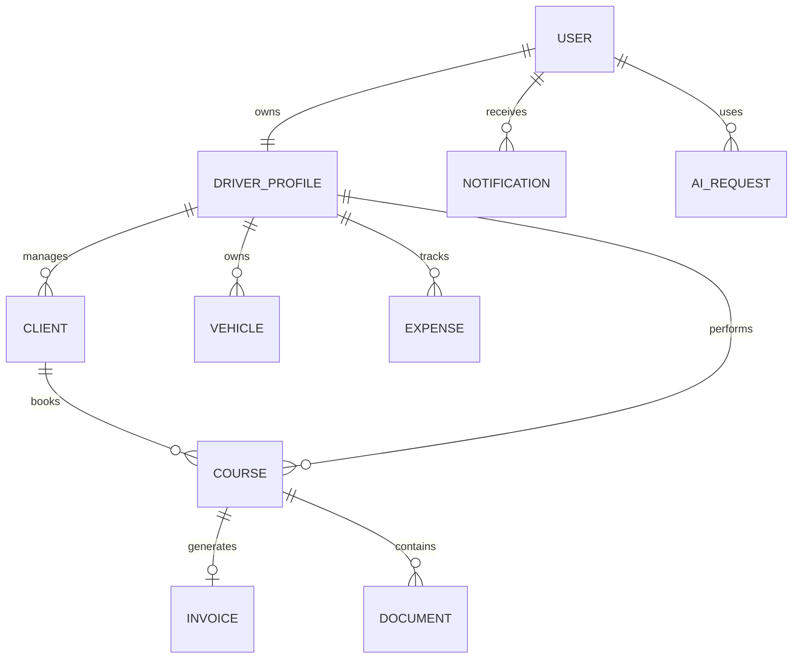

# 🗄️ DATABASE_SCHEMA.md

# Uber's Clap

> Architecture base de données

Version : 0.1.0

---

# 📖 Introduction

La base de données Uber's Clap doit permettre de gérer l'ensemble de l'activité d'un chauffeur VTC :

- utilisateurs
- profils chauffeurs
- clients
- véhicules
- courses
- factures
- dépenses
- documents
- notifications
- intelligence artificielle

---

# 🎯 Objectifs

La base doit être :

- sécurisée
- scalable
- optimisée
- adaptée à un SaaS multi-utilisateurs

---

# 🏗️ Technologie

Base principale :

```
PostgreSQL
```

ORM :

```
TypeORM / Prisma
```

---

# 🔐 Principe Multi-Tenant

Chaque chauffeur possède ses propres données.

Exemple :

```
Chauffeur A

 ├── Clients

 ├── Courses

 ├── Factures

 └── Dépenses


Chauffeur B

 ├── Clients

 ├── Courses

 ├── Factures

 └── Dépenses

```

Les données ne doivent jamais être mélangées.

---

# 📊 Schéma global



---

# 👤 Table User

## Description

Compte utilisateur principal.

---

Table :

```
users
```

---

Champs :

```sql
id UUID PRIMARY KEY

email VARCHAR UNIQUE

password_hash VARCHAR

phone VARCHAR

first_name VARCHAR

last_name VARCHAR

role VARCHAR

created_at TIMESTAMP

updated_at TIMESTAMP

```

---

Roles :

```
DRIVER

ADMIN

MANAGER

```

---

# 🚗 Table Driver Profile

## Description

Informations professionnelles du chauffeur.

---

Table :

```
driver_profiles
```

---

Champs :

```sql
id UUID

user_id UUID

company_name VARCHAR

siret VARCHAR

address TEXT

logo_url TEXT

license_number VARCHAR

created_at TIMESTAMP

updated_at TIMESTAMP

```

---

# 👥 Table Clients

## Description

Clients privés ou professionnels.

---

Table :

```
clients
```

---

Champs :

```sql
id UUID

driver_id UUID

first_name VARCHAR

last_name VARCHAR

company VARCHAR

phone VARCHAR

email VARCHAR

address TEXT

notes TEXT

created_at TIMESTAMP

updated_at TIMESTAMP

```

---

# 🚘 Table Vehicles

## Description

Véhicules utilisés par le chauffeur.

---

Table :

```
vehicles
```

---

Champs :

```sql
id UUID

driver_id UUID

brand VARCHAR

model VARCHAR

year INT

registration VARCHAR

color VARCHAR

active BOOLEAN

created_at TIMESTAMP

```

---

# 🚕 Table Courses

## Description

Élément central de l'application.

---

Table :

```
courses
```

---

Champs :

```sql
id UUID

driver_id UUID

client_id UUID

vehicle_id UUID


pickup_address TEXT

destination_address TEXT


start_date TIMESTAMP

end_date TIMESTAMP


course_type VARCHAR


status VARCHAR


estimated_price DECIMAL

final_price DECIMAL


distance FLOAT

duration INT


notes TEXT


created_at TIMESTAMP

updated_at TIMESTAMP

```

---

# Types de courses

```
ONE_WAY

ROUND_TRIP

AIRPORT

STATION

EVENT

OTHER

```

---

# Statuts

```
PLANNED

CONFIRMED

ONGOING

COMPLETED

CANCELLED

```

---

# 🧾 Table Invoices

## Description

Factures générées.

---

Table :

```
invoices
```

---

Champs :

```sql
id UUID

driver_id UUID

course_id UUID


invoice_number VARCHAR


amount DECIMAL


status VARCHAR


pdf_url TEXT


issued_at TIMESTAMP


created_at TIMESTAMP

```

---

# Statuts facture

```
DRAFT

SENT

PAID

OVERDUE

CANCELLED

```

---

# 💸 Table Expenses

## Description

Suivi dépenses chauffeur.

---

Table :

```
expenses
```

---

Champs :

```sql
id UUID

driver_id UUID

category VARCHAR

amount DECIMAL

date DATE

description TEXT

receipt_url TEXT

created_at TIMESTAMP

```

---

# Catégories

```
FUEL

TOLL

PARKING

MAINTENANCE

INSURANCE

OTHER

```

---

# 📄 Table Documents

## Description

Documents associés.

---

Table :

```
documents
```

---

Champs :

```sql
id UUID

driver_id UUID

course_id UUID


type VARCHAR

file_url TEXT

signature_data TEXT


created_at TIMESTAMP

```

---

Types :

```
INVOICE

SIGNATURE

CONTRACT

RECEIPT

OTHER

```

---

# 🔔 Table Notifications

## Description

Notifications utilisateur.

---

Table :

```
notifications
```

---

Champs :

```sql
id UUID

user_id UUID

title VARCHAR

message TEXT

type VARCHAR

read BOOLEAN

scheduled_at TIMESTAMP

created_at TIMESTAMP

```

---

# 🤖 Table AI Requests

## Description

Historique utilisation IA.

---

Table :

```
ai_requests
```

---

Champs :

```sql
id UUID

user_id UUID


prompt TEXT

response TEXT


model VARCHAR


tokens_used INT


created_at TIMESTAMP

```

---

# 📍 Table Locations

(Future)

## Description

Historique GPS.

---

Table :

```
locations
```

---

Champs :

```sql
id UUID

course_id UUID

latitude FLOAT

longitude FLOAT

timestamp TIMESTAMP

```

---

# 🏢 Future : Organizations

Pour les sociétés VTC.

---

Table :

```
organizations
```

---

Champs :

```sql
id UUID

name VARCHAR

owner_id UUID

created_at TIMESTAMP

```

---

# 👨‍💼 Future : Organization Members

Gestion équipes.

---

Table :

```
organization_members
```

---

Champs :

```sql
id UUID

organization_id UUID

user_id UUID

role VARCHAR

```

---

# 🔍 Index importants

Pour performances :

---

Courses :

```sql
(driver_id, start_date)
```

---

Clients :

```sql
(driver_id, phone)
```

---

Factures :

```sql
(driver_id, created_at)
```

---

# 🔒 Sécurité données

Obligatoire :

- UUID au lieu d'ID incrémental public
- isolation par driver_id
- validation permissions API
- suppression sécurisée

---

# 🗑️ Suppression données

Utiliser :

Soft Delete.

---

Exemple :

```sql
deleted_at TIMESTAMP
```

---

Objectif :

Conserver historique légal.

---

# 📈 Scalabilité

Préparation future :

- partitionnement courses
- archivage historique
- cache Redis
- recherche Elasticsearch

---

# Conclusion

Le modèle de données Uber's Clap est conçu autour de l'entité principale :

```
COURSE
```

Toutes les fonctionnalités gravitent autour de la prestation chauffeur :

Client → Course → Facture → Analyse → Optimisation.

Cette architecture permet d'évoluer d'un outil indépendant vers une plateforme complète de gestion VTC.
