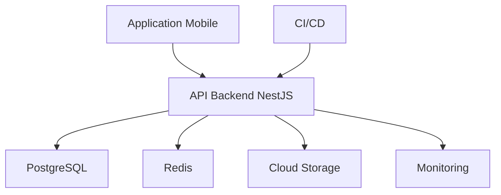
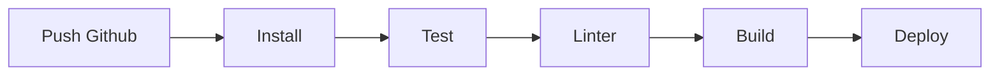

# 🚀 DEPLOYMENT.md

# Uber's Clap

> Documentation déploiement et infrastructure

Version : 0.1.0

---

# 📖 Introduction

Uber's Clap est une application SaaS mobile nécessitant une infrastructure fiable et scalable.

L'architecture de déploiement doit permettre :

- développement rapide
- tests automatisés
- mises à jour sécurisées
- haute disponibilité
- surveillance du système

---

# 🏗️ Architecture production



---

# 🌍 Environnements

Le projet possède 3 environnements.

---

# 🧪 Development

Objectif :

Développement local.

Utilisation :

- Docker Compose
- Base locale
- Services simulés

---

Services :

```
Backend

PostgreSQL

Redis

Mail Service
```

---

# 🔍 Staging

Objectif :

Tester avant production.

Utilisateurs :

- développeurs
- testeurs internes

---

Utilisation :

- vraie infrastructure
- données de test
- tests complets

---

# 🚀 Production

Objectif :

Application utilisée par les chauffeurs.

---

Contraintes :

- sécurité maximale
- sauvegardes
- monitoring
- disponibilité

---

# 🐳 Docker

Docker est utilisé pour standardiser l'environnement.

---

# Services Docker

```
docker-compose.yml

├── backend

├── postgres

├── redis

└── worker

```

---

# Exemple architecture locale

```yaml
services:
  backend:
    build: ./backend
    ports:
      - 3000:3000

  postgres:
    image: postgres

  redis:
    image: redis
```

---

# 📦 Backend Deployment

## Technologie

NestJS.

---

# Build

Commande :

```
npm run build
```

---

Production :

```
npm run start:prod
```

---

# Variables environnement

Exemple :

```
DATABASE_URL=

JWT_SECRET=

REDIS_URL=

OPENAI_API_KEY=

STORAGE_KEY=

```

---

# 📱 Mobile Deployment

Application développée avec :

- React Native
- Expo

---

# Android

Publication :

Google Play Store

---

# iOS

Publication :

Apple App Store

---

# Build

Utilisation :

Expo Application Services (EAS)

---

Commandes :

```
eas build

eas submit
```

---

# 🔄 CI/CD

Outil :

GitHub Actions.

---

# Pipeline Backend

À chaque push :



---

# Étapes

## 1. Installation

```
npm install
```

---

## 2. Vérification code

```
npm run lint
```

---

## 3. Tests

```
npm run test
```

---

## 4. Build

```
npm run build
```

---

## 5. Déploiement

Automatique.

---

# 🗄️ Database Deployment

## PostgreSQL

Solutions possibles :

- Supabase
- Neon
- AWS RDS
- Railway

---

# Recommandation MVP

## Supabase PostgreSQL

Avantages :

- PostgreSQL natif
- Dashboard
- Auth possible
- Storage possible
- Backup automatique

---

# Migration database

Utilisation ORM.

Commandes :

```
migration:create

migration:run

migration:revert
```

---

# Redis Deployment

Utilisé pour :

- queues
- cache
- tâches automatiques

---

Solutions :

- Upstash Redis
- Redis Cloud
- AWS ElastiCache

---

# 📁 Storage Deployment

Stockage :

Cloudflare R2.

---

Utilisation :

- factures PDF
- signatures
- documents

---

Avantages :

- coût faible
- compatible S3
- stockage privé

---

# 🌐 Hébergement Backend

Solutions possibles :

---

# Option MVP

## Railway / Render

Avantages :

- simple
- rapide
- peu de configuration

---

# Option scalable

## AWS

Services :

- ECS
- RDS
- S3
- CloudFront

---

# Option moderne

## Fly.io

Avantages :

- proche utilisateurs
- déploiement simple

---

# 🔐 Sécurité production

Obligatoire :

- HTTPS
- variables secrètes protégées
- firewall
- backups
- monitoring

---

# 📊 Monitoring

## Sentry

Surveillance :

- erreurs backend
- crash mobile
- performance

---

# Logs

Utilisation :

- logs structurés JSON
- rotation automatique

---

# Alertes

Déclencheurs :

- erreur serveur importante
- base inaccessible
- saturation mémoire

---

# 🧪 Tests avant production

Checklist :

## Backend

[ ] Tests unitaires

[ ] Tests API

[ ] Migration database

[ ] Vérification sécurité

---

## Mobile

[ ] Test Android

[ ] Test iOS

[ ] Notifications

[ ] GPS

[ ] Signature

---

# 🔄 Mise à jour application

Mobile :

Utilisation :

- OTA updates Expo
- nouvelles versions Store

---

Backend :

Déploiement :

- rolling update
- rollback possible

---

# 📈 Scalabilité

Evolution possible :

---

## Niveau 1

Quelques centaines utilisateurs :

```
1 serveur API

1 database

1 Redis
```

---

## Niveau 2

Milliers utilisateurs :

```
Load Balancer

+

plusieurs instances API

```

---

## Niveau 3

Grande plateforme :

```
Services séparés

Workers dédiés

Infrastructure cloud complète

```

---

# 💰 Estimation coût MVP

Infrastructure mensuelle approximative :

| Service      | Prix           |
| ------------ | -------------- |
| Backend      | 5-20€          |
| PostgreSQL   | 0-25€          |
| Redis        | 0-10€          |
| Storage      | Quelques €     |
| Monitoring   | Gratuit/Payant |
| Services API | Variable       |

---

# Conclusion

L'infrastructure Uber's Clap est conçue pour commencer avec une architecture simple et économique tout en permettant une évolution vers une plateforme SaaS professionnelle capable de supporter plusieurs milliers de chauffeurs.
