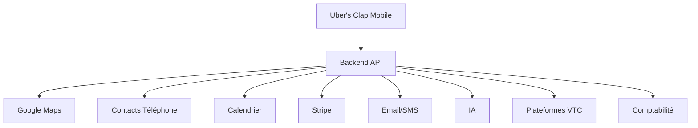

# 🔌 INTEGRATIONS.md

# Uber's Clap

> Documentation des intégrations externes

Version : 0.1.0

---

# 📖 Introduction

Uber's Clap doit être une application connectée à son environnement.

Un chauffeur VTC utilise déjà plusieurs services au quotidien :

- GPS
- téléphone
- calendrier
- messagerie
- paiement
- comptabilité
- plateformes de réservation

L'objectif est de centraliser l'activité tout en restant connecté aux outils existants.

---

# 🎯 Objectifs

Les intégrations doivent permettre :

- gagner du temps
- éviter les doubles saisies
- automatiser les tâches
- améliorer l'expérience chauffeur
- préparer l'évolution SaaS

---

# 🏗️ Architecture générale



---

# 🗺️ 1. Cartographie & Navigation

## Objectif

Faciliter les déplacements du chauffeur.

---

# Google Maps API

Service :

```
Google Maps Platform
```

---

Utilisations :

## Géocodage

Transformer :

```
Adresse → Coordonnées GPS
```

---

Exemple :

```
Paris Gare de Lyon

↓

48.8448, 2.3735
```

---

## Calcul itinéraire

Permettre :

- distance
- durée trajet
- estimation arrivée

---

## Navigation

Bouton :

```
Démarrer navigation
```

ouvre :

- Google Maps
- Apple Plans
- Waze

---

# Alternative

## Mapbox

Avantages :

- personnalisation
- coût maîtrisé
- meilleur contrôle UI

---

# 📱 2. Contacts téléphone

## Objectif

Importer rapidement les clients existants.

---

Sources :

iOS :

```
Contacts Framework
```

Android :

```
Contacts Provider
```

---

Fonctionnalités :

- importer contact
- rechercher numéro
- créer client automatiquement

---

Exemple :

Contact :

```
Jean Dupont
06 XX XX XX XX
```

↓

Création client :

```
Jean Dupont

Téléphone enregistré

```

---

# 🔐 Permission

L'utilisateur doit accepter :

```
Autoriser l'accès aux contacts ?
```

---

# 📅 3. Calendrier

## Objectif

Synchroniser les courses.

---

Services :

- Google Calendar
- Apple Calendar

---

Fonctionnalités :

Créer automatiquement :

```
Course VTC

10h00

CDG → Paris

Client : Martin
```

---

Synchronisation :

Deux sens possibles :

---

## MVP

Uber's Clap → Calendrier

---

## Future

Calendrier → Uber's Clap

---

# 🔔 4. Notifications Push

## Objectif

Informer le chauffeur.

---

Technologies :

---

Android :

```
Firebase Cloud Messaging
```

---

iOS :

```
Apple Push Notification Service
```

---

Utilisations :

- rappel course
- nouvelle réservation
- facture disponible

---

# 💬 5. SMS & Messagerie

## Objectif

Automatiser la communication client.

---

Services possibles :

- Twilio
- MessageBird
- Brevo

---

Utilisations :

---

Confirmation :

```
Bonjour,

Votre chauffeur confirme votre réservation demain 15h.

```

---

Rappel :

```
Votre chauffeur arrive dans 30 minutes.

```

---

# 📧 6. Email

## Objectif

Envoyer documents et communications.

---

Services :

- SendGrid
- Resend
- Amazon SES

---

Utilisations :

- facture PDF
- confirmation course
- documents professionnels

---

# 💳 7. Paiement

## Stripe

Objectif :

Gestion abonnement SaaS.

---

Fonctionnalités :

- abonnements
- paiements
- factures
- remboursements

---

Utilisation :

```
Utilisateur

↓

Stripe Checkout

↓

Activation Premium

```

---

# 🧾 8. Comptabilité

(Future)

## Objectif

Exporter automatiquement les données comptables.

---

Solutions possibles :

- Pennylane
- Indy
- Sage
- QuickBooks

---

Fonctionnalités :

Exporter :

- factures
- revenus
- dépenses

---

# 🤖 9. Intelligence artificielle

## Objectif

Créer un assistant chauffeur.

---

Solutions :

- OpenAI API
- Claude API
- modèles locaux

---

Fonctionnalités :

---

## Création course intelligente

Message :

```
Demain 8h Charles CDG vers Hôtel Ritz
```

IA :

```
Client :
Charles

Départ :
CDG

Destination :
Hôtel Ritz

Heure :
08h00

Créer ?
```

---

## Assistant financier

Questions :

```
Combien ai-je gagné cette semaine ?
```

---

Réponse :

```
Votre CA est de 2400€
Votre bénéfice estimé est 1900€
```

---

# 📸 10. Stockage fichiers

## Objectif

Stocker :

- factures PDF
- signatures
- documents

---

Solutions :

- AWS S3
- Cloudflare R2
- Supabase Storage

---

Structure :

```
storage/

 users/

  invoices/

  documents/

  signatures/

```

---

# 🔐 11. Authentification externe

(Future)

---

Possibilités :

- Apple Sign In
- Google OAuth

---

Objectif :

Connexion rapide.

---

# 🚗 12. Plateformes VTC

(Future avancée)

## Objectif

Centraliser les courses provenant d'autres plateformes.

---

Sources possibles :

- Uber
- Bolt
- Free Now
- Heetch

---

Fonctionnalités :

Importer :

- courses
- revenus
- statistiques

---

Architecture :

```
Plateforme

↓

API Connector

↓

Uber's Clap

```

---

# ⚠️ Contraintes

Certaines plateformes ne proposent pas toujours d'accès public.

---

Solutions :

- partenariats
- exports CSV
- intégrations officielles

---

# 🏦 13. Open Banking

(Future)

## Objectif

Suivre automatiquement les dépenses.

---

Solutions :

- Bridge API
- Tink

---

Utilisation :

Importer :

- carburant
- assurance
- paiements

---

# 📊 14. Analytics

## Objectif

Comprendre l'utilisation.

---

Solutions :

- PostHog
- Amplitude
- Mixpanel

---

Suivre :

- événements
- parcours
- rétention

---

# 🛡️ Sécurité intégrations

Toutes les intégrations doivent respecter :

- OAuth 2.0
- chiffrement données
- rotation tokens
- permissions minimales

---

# 🇪🇺 RGPD

Obligations :

- consentement utilisateur
- suppression données
- export données personnelles
- transparence utilisation données

---

# 🚀 Roadmap intégrations

---

# MVP

Priorité :

✅ Google Maps

✅ Contacts téléphone

✅ Push notifications

✅ Stripe

✅ Stockage fichiers

---

# Version 1.5

Ajouter :

- Calendrier
- SMS automatique
- Email avancé

---

# Version 2.0

Ajouter :

- IA complète
- Comptabilité
- Open Banking

---

# Version Enterprise

Ajouter :

- plateformes VTC
- API partenaires
- flotte chauffeurs

---

# Conclusion

Les intégrations transforment Uber's Clap d'une simple application mobile en véritable écosystème professionnel.

L'objectif n'est pas de remplacer tous les outils du chauffeur, mais de les connecter dans une seule expérience fluide.
