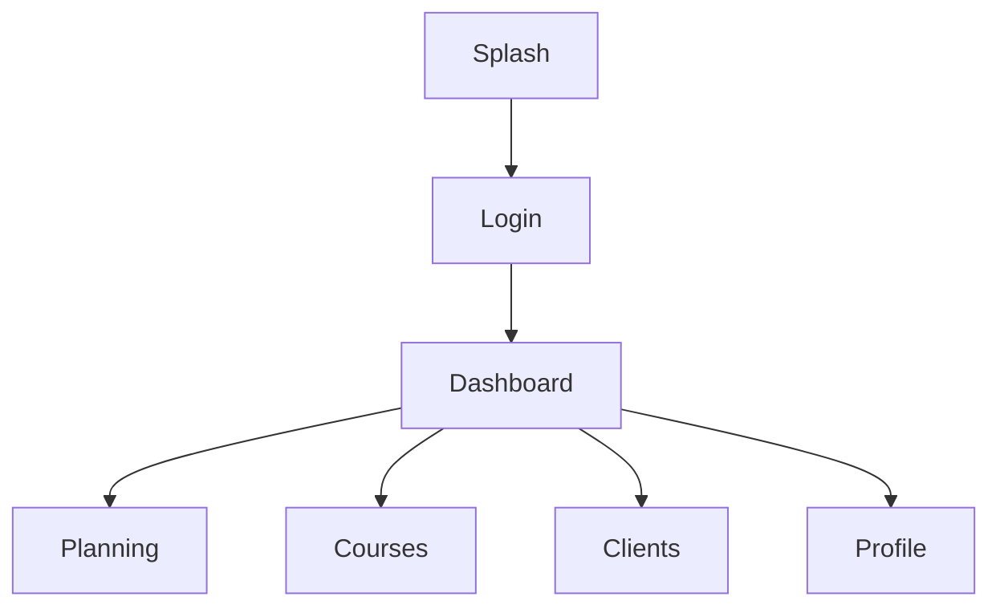

# 📱 MOBILE_ARCHITECTURE.md

# Uber's Clap

> Architecture application mobile

Version : 0.1.0

---

# 📖 Introduction

Uber's Clap est une application mobile destinée aux chauffeurs VTC.

L'application doit être :

- rapide
- fiable
- utilisable en mobilité
- adaptée à une utilisation quotidienne intensive

Le mobile représente le cœur du produit.

---

# 🎯 Objectifs architecture

L'application doit garantir :

✅ Performance

✅ Maintenabilité

✅ Évolutivité

✅ Expérience utilisateur fluide

✅ Support Android et iOS

---

# 🏗️ Stack mobile recommandée

---

# Framework

```
React Native
+
Expo
```

---

# Langage

```
TypeScript
```

---

# Pourquoi React Native + Expo ?

Avantages :

✅ Une seule base de code

✅ Développement rapide

✅ Accès fonctionnalités natives

✅ Écosystème mature

✅ Déploiement simplifié

---

# UI Framework

Options :

---

## Option recommandée

```
NativeWind
```

(Tailwind pour React Native)

---

Alternative :

- Tamagui
- React Native Paper
- Gluestack UI

---

# Navigation

Solution :

```
Expo Router
```

---

Architecture :

```
app/

 ├── (auth)

 │    ├── login.tsx

 │    └── register.tsx


 ├── (tabs)

 │    ├── dashboard.tsx

 │    ├── planning.tsx

 │    ├── courses.tsx

 │    ├── clients.tsx

 │    └── profile.tsx

```

---

# 🧭 Navigation principale

Structure :

```
Authentication

↓

Main Application

↓

Features

```

---

# Exemple



---

# 📂 Structure projet recommandée

```
mobile/

├── app/

├── assets/

├── components/

├── features/

├── hooks/

├── services/

├── store/

├── utils/

├── types/

├── constants/

└── config/

```

---

# Organisation par fonctionnalité

Approche :

Feature Based Architecture

---

Exemple :

```
features/

 └── courses/

      ├── components/

      ├── hooks/

      ├── api.ts

      ├── types.ts

      └── validation.ts

```

---

# 🧩 Components

Composants réutilisables :

```
components/

 ├── Button

 ├── Input

 ├── Card

 ├── Modal

 ├── Loader

 └── EmptyState

```

---

# 🌐 Communication API

Client HTTP :

```
Axios
```

---

Architecture :

```
services/

 ├── api.ts

 ├── auth.api.ts

 ├── courses.api.ts

 ├── clients.api.ts

 └── invoices.api.ts

```

---

# Exemple

```ts
coursesApi.getAll();
```

---

# 🔐 Gestion authentification

Stockage :

```
Expo SecureStore
```

---

Stocker :

- access token
- refresh token

---

Flux :

```
Login

↓

Save Token

↓

Auto Login

↓

Refresh Token

```

---

# 🗃️ Gestion état global

Solution recommandée :

```
Zustand
```

---

Pourquoi ?

- léger
- simple
- performant

---

Utilisation :

```
authStore

userStore

settingsStore

```

---

# 📦 Gestion données serveur

Solution :

```
TanStack Query
```

---

Responsabilités :

- cache API
- synchronisation
- loading
- retry

---

Architecture :

```
API

↓

React Query

↓

Components

```

---

# 📴 Mode Offline

Important pour les chauffeurs.

Un chauffeur peut avoir :

- mauvaise connexion
- zones sans réseau

---

Objectif :

Permettre :

- consulter planning
- voir clients
- créer une course temporairement

---

# Solution

Stockage local :

```
SQLite
```

avec :

```
Expo SQLite
```

---

Architecture :

```
API

↓

Local Database

↓

Sync Engine

↓

Application

```

---

# Synchronisation offline

Exemple :

Création course hors ligne :

```
Course créée localement

↓

Connexion retrouvée

↓

Synchronisation serveur

↓

Confirmation

```

---

# 📍 Géolocalisation

Technologies :

```
Expo Location
```

---

Utilisations :

- position chauffeur
- distance course
- navigation

---

Permissions :

Demander :

```
Autoriser localisation ?
```

---

# 📞 Contacts téléphone

Technologie :

```
Expo Contacts
```

---

Fonctions :

- importer client
- rechercher contact

---

# 🔔 Notifications

Technologie :

```
Expo Notifications
```

---

Gestion :

- token push
- permissions
- deep links

---

# 📄 PDF et documents

Fonctions :

- visualisation facture
- partage document

---

Technologies :

- Expo Sharing
- FileSystem

---

# ✍️ Signature

Technologie possible :

- React Native Signature Canvas

---

Stockage :

Image + metadata.

---

# ⚡ Performance

Objectifs :

---

Ouverture application :

```
< 2 secondes
```

---

Actions principales :

```
< 300ms
```

---

Optimisations :

- lazy loading
- memoisation
- pagination
- cache données

---

# 🧪 Tests mobile

---

Unit Tests :

```
Jest
```

---

Composants :

```
React Native Testing Library
```

---

E2E :

```
Maestro
```

ou

```
Detox
```

---

# 🚀 Build & Distribution

---

Développement :

```
Expo Development Build
```

---

Production :

```
EAS Build
```

---

Stores :

Android :

```
Google Play Store
```

iOS :

```
Apple App Store
```

---

# 🔄 CI/CD Mobile

Pipeline :

```
Git Push

↓

Tests

↓

Build

↓

EAS Submit

↓

Store

```

---

# 📊 Monitoring mobile

Solutions :

- Sentry
- Firebase Crashlytics

---

Surveiller :

- crash
- performance
- erreurs utilisateurs

---

# 🔐 Sécurité mobile

Règles :

- pas de secrets dans l'application
- stockage sécurisé tokens
- chiffrement données locales
- validation côté serveur

---

# 🚀 Évolutions futures

---

# Application Apple Watch

Pour :

- rappels courses
- notifications rapides

---

# CarPlay / Android Auto

Pour :

- navigation
- informations course

---

# Mode entreprise

Support :

- plusieurs comptes chauffeurs
- appareils partagés

---

# Conclusion

L'architecture mobile Uber's Clap est pensée pour une application professionnelle utilisée quotidiennement par des chauffeurs.

Le choix React Native + Expo permet un développement rapide tout en gardant une base solide capable d'évoluer vers une plateforme complète.
