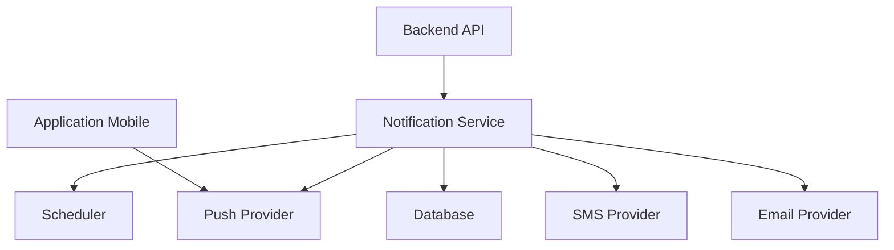

# 🔔 NOTIFICATIONS_SYSTEM.md

# Uber's Clap

> Système de notifications et automatisations

Version : 0.1.0

---

# 📖 Introduction

Les notifications sont un élément essentiel d'Uber's Clap.

Un chauffeur VTC doit gérer de nombreux événements :

- réservations
- changements horaires
- rappels clients
- facturation
- tâches administratives

L'objectif est de réduire les oublis et automatiser les actions répétitives.

---

# 🎯 Objectifs

Le système doit permettre :

- prévenir le chauffeur au bon moment
- améliorer l'expérience client
- automatiser les communications
- réduire la charge administrative

---

# 🏗️ Architecture globale



---

# 📱 Types de notifications

Uber's Clap utilise plusieurs canaux :

---

# 1. Push Notification

Utilisation principale.

Technologies :

- Expo Notifications
- Firebase Cloud Messaging
- Apple Push Notification Service

---

Exemples :

```
Votre prochaine course est dans 30 minutes.
```

---

# 2. SMS

Utilisation premium.

Exemples :

- confirmation client
- rappel réservation
- retard chauffeur

---

# 3. Email

Utilisation administrative.

Exemples :

- envoi facture
- documents
- récapitulatif activité

---

# 4. Notification interne

Visible dans l'application.

Exemple :

```
Vous avez 3 factures impayées.
```

---

# 🚗 Notifications courses

---

# Création d'une course

Événement :

```
COURSE_CREATED
```

Actions :

Chauffeur :

```
Nouvelle course ajoutée au planning.
```

---

# Modification d'une course

Événement :

```
COURSE_UPDATED
```

Actions :

```
La course de 14h30 a été modifiée.
```

---

# Annulation d'une course

Événement :

```
COURSE_CANCELLED
```

Actions :

```
La course avec Jean Dupont a été annulée.
```

---

# Rappel avant course

## Objectif

Éviter les oublis.

---

Configuration :

Par défaut :

```
24h avant

1h avant

15 minutes avant

```

---

Exemple :

```
🚗 Rappel course

Client :
Jean Dupont

Départ :
Hôtel Hilton

Heure :
15h30

```

---

# 🧑‍💼 Notifications client

(Future version)

---

# Confirmation réservation

Message :

```
Bonjour Jean,

Votre réservation est confirmée.

Votre chauffeur sera présent demain à 15h.

Uber's Clap
```

---

# Rappel automatique

24h avant :

```
Votre chauffeur vous retrouvera demain à 15h.
```

---

# Information retard

Message :

```
Votre chauffeur aura environ 10 minutes de retard.
```

---

# 🧾 Notifications facturation

---

# Création facture

Événement :

```
INVOICE_CREATED
```

---

Notification :

```
Votre facture #2026-001 est disponible.
```

---

# Paiement reçu

Future version :

```
Paiement confirmé.
```

---

# ⚠️ Notifications administratives

---

Exemples :

## Factures non envoyées

```
Vous avez 5 factures en attente.
```

---

## Courses non facturées

```
3 courses terminées nécessitent une facture.
```

---

## Dépenses manquantes

```
Ajoutez vos dépenses carburant de la semaine.
```

---

# 🤖 Notifications intelligentes IA

Future évolution.

---

L'IA peut détecter :

---

# Oublis

Exemple :

```
Vous avez terminé une course hier mais aucune facture n'a été créée.
```

---

# Optimisation

Exemple :

```
Votre prochaine course est dans 20 minutes.
Prévoyez 15 minutes de trajet.
```

---

# Analyse activité

Exemple :

```
Votre chiffre d'affaires est supérieur de 20% cette semaine.
```

---

# ⚙️ Automatisation des tâches

Les notifications utilisent un système de tâches planifiées.

---

Technologies possibles :

- BullMQ
- Redis Queue
- Cron Jobs

---

Exemple :

```
Course à 18h

↓

Scheduler détecte

↓

Création notification

↓

Envoi mobile

```

---

# 🗄️ Modèle de données

Table :

```
notifications
```

---

Structure :

```sql
id UUID

user_id UUID

type VARCHAR

title VARCHAR

message TEXT

channel VARCHAR

status VARCHAR

scheduled_at TIMESTAMP

sent_at TIMESTAMP

created_at TIMESTAMP

```

---

# Types

```
COURSE_REMINDER

COURSE_UPDATE

INVOICE_CREATED

PAYMENT_REMINDER

SYSTEM

AI_ALERT

```

---

# Statuts

```
PENDING

SENT

FAILED

CANCELLED

```

---

# ⚡ Préférences utilisateur

Chaque chauffeur peut configurer :

---

Notifications activées :

☑ Rappels courses

☑ Factures

☑ Statistiques

☑ IA

☑ Marketing

---

Horaires :

Exemple :

```
Ne pas déranger :
22h - 7h
```

---

# 🔐 Sécurité

Le système doit garantir :

- aucune fuite de données client
- validation destinataire
- logs sécurisés
- respect RGPD

---

# 📊 Analytics notifications

Mesurer :

- taux ouverture
- taux clic
- taux conversion
- désactivation notifications

---

# 🚀 Roadmap

---

# MVP

Inclure :

✅ Push notifications courses

✅ Rappel prochaine course

✅ Notifications système

---

# Version Premium

Ajouter :

- SMS clients
- emails automatiques
- règles personnalisées

---

# Version IA

Ajouter :

- suggestions intelligentes
- prévention oublis
- optimisation planning

---

# Conclusion

Le système de notifications transforme Uber's Clap d'un simple outil de gestion en véritable assistant quotidien.

L'objectif est que le chauffeur n'ait plus besoin de penser à tout : l'application l'accompagne automatiquement.
