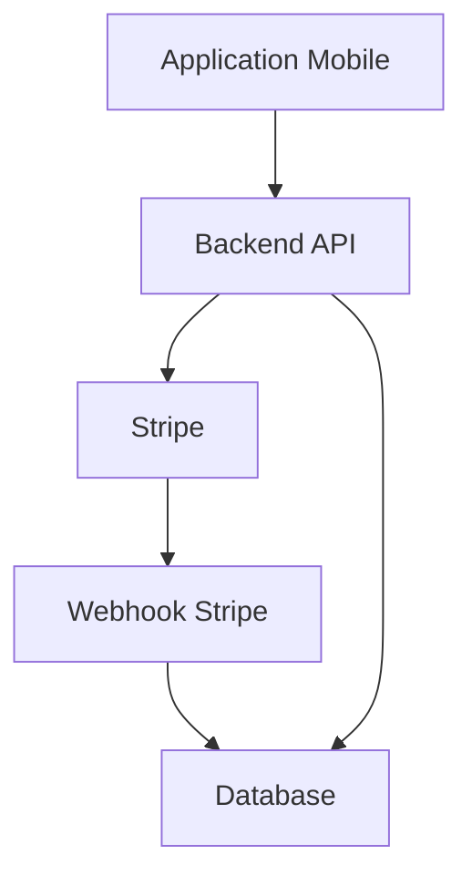
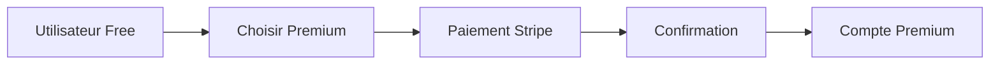

# 💳 PAYMENT_AND_BILLING.md

# Uber's Clap

> Système de paiement et facturation SaaS

Version : 0.1.0

---

# 📖 Introduction

Uber's Clap fonctionne sur un modèle SaaS avec abonnement mensuel ou annuel.

Le système de paiement permet de gérer :

- abonnements utilisateurs
- plans Premium
- plans Business
- renouvellements automatiques
- factures abonnement
- historique paiements

---

# 🎯 Objectifs

Le système doit être :

- simple pour l'utilisateur
- sécurisé
- automatisé
- compatible avec une croissance SaaS

---

# 💳 Solution paiement

Solution recommandée :

```
Stripe
```

---

# Pourquoi Stripe ?

Avantages :

✅ Solution internationale

✅ Gestion abonnements native

✅ Paiements sécurisés

✅ Gestion TVA

✅ Portail client

✅ Webhooks

---

# 🏗️ Architecture paiement



---

# 💰 Plans abonnement

---

# 🆓 Plan Free

Objectif :

Découverte application.

---

Prix :

```
0€/mois
```

---

Limites :

- Nombre limité de courses
- Nombre limité de clients
- Pas d'automatisation
- Pas d'IA avancée

---

# ⭐ Plan Premium

Plan principal.

---

Prix :

```
9,99€/mois
```

ou

```
99€/an
```

---

Fonctionnalités :

- Courses illimitées
- Clients illimités
- Planning avancé
- Facturation PDF
- Notifications automatiques
- Statistiques avancées
- IA incluse

---

# 🚀 Plan Business

Pour entreprises VTC.

---

Prix :

```
29,99€/mois
```

- utilisateurs supplémentaires

---

Fonctionnalités :

- Gestion équipe
- Plusieurs chauffeurs
- Véhicules
- Planning partagé
- Statistiques entreprise

---

# 🏢 Plan Enterprise

Prix personnalisé.

---

Fonctionnalités :

- API dédiée
- Support prioritaire
- Contrat entreprise
- SLA

---

# 📱 Parcours abonnement utilisateur

---



---

# Étape 1

Utilisateur ouvre :

```
Paramètres > Abonnement
```

---

# Étape 2

Choisit :

- Mensuel
- Annuel

---

# Étape 3

Paiement Stripe.

---

# Étape 4

Validation automatique.

---

# 🔄 Gestion abonnement

Événements Stripe :

---

# Subscription Created

Création abonnement.

Action :

```
Activation Premium
```

---

# Subscription Updated

Modification :

- changement plan
- changement moyen paiement

---

# Subscription Cancelled

Action :

```
Retour Free à expiration période
```

---

# Payment Failed

Action :

Notification :

```
Votre paiement a échoué.
```

---

# 🧾 Factures abonnement

Chaque paiement génère :

- facture
- historique
- reçu

---

Informations :

- utilisateur
- période
- montant
- TVA
- statut

---

# Statuts facture

```
PAID

PENDING

FAILED

REFUNDED

```

---

# 🗄️ Modèle base de données

---

# Table subscriptions

```sql
id UUID

user_id UUID

stripe_customer_id VARCHAR

stripe_subscription_id VARCHAR

plan VARCHAR

status VARCHAR

start_date DATE

end_date DATE

created_at TIMESTAMP

```

---

# Table payments

```sql
id UUID

user_id UUID

subscription_id UUID

stripe_payment_id VARCHAR

amount DECIMAL

currency VARCHAR

status VARCHAR

created_at TIMESTAMP

```

---

# Table invoices

```sql
id UUID

user_id UUID

stripe_invoice_id VARCHAR

amount DECIMAL

pdf_url TEXT

status VARCHAR

created_at TIMESTAMP

```

---

# 🔐 Sécurité paiement

Règles :

- aucune donnée bancaire stockée
- utilisation Stripe Checkout
- validation webhook obligatoire
- signature webhook vérifiée

---

# Webhooks Stripe

Exemples :

```
payment_success

subscription_created

subscription_cancelled

invoice_paid

```

---

# 🧠 Gestion accès fonctionnalités

Le backend contrôle les permissions.

---

Exemple :

Utilisateur Free :

```json
{
  "ai": false,
  "sms": false
}
```

---

Utilisateur Premium :

```json
{
  "ai": true,
  "sms": true
}
```

---

# 📊 Analytics Business

Suivre :

---

## Revenus

- MRR
- ARR
- revenus mensuels

---

## Utilisateurs

- nouveaux abonnés
- conversions
- résiliations

---

## Rétention

- churn
- durée abonnement

---

# 🎁 Stratégies commerciales

---

# Essai gratuit

Premium :

```
14 ou 30 jours
```

---

# Parrainage

Un chauffeur invite :

```
1 mois offert
```

---

# Réduction annuelle

Objectif :

augmenter engagement.

Exemple :

```
12 mois = 10 mois payés
```

---

# 💸 Gestion remboursement

Cas :

- erreur paiement
- problème technique
- demande client

---

Process :

1. Demande utilisateur
2. Vérification
3. Remboursement Stripe
4. Historique conservé

---

# 🚀 Évolutions futures

---

# Paiement courses intégré

Possibilité :

Le client paye directement via application.

---

# Commission

Exemple :

```
1-2% par transaction
```

---

# Marketplace

Services partenaires :

- assurance
- entretien
- leasing

---

# Conclusion

Le système de paiement transforme Uber's Clap en véritable SaaS professionnel.

Stripe permet une gestion simple des abonnements tout en préparant l'évolution vers une plateforme complète pour les professionnels du transport.
