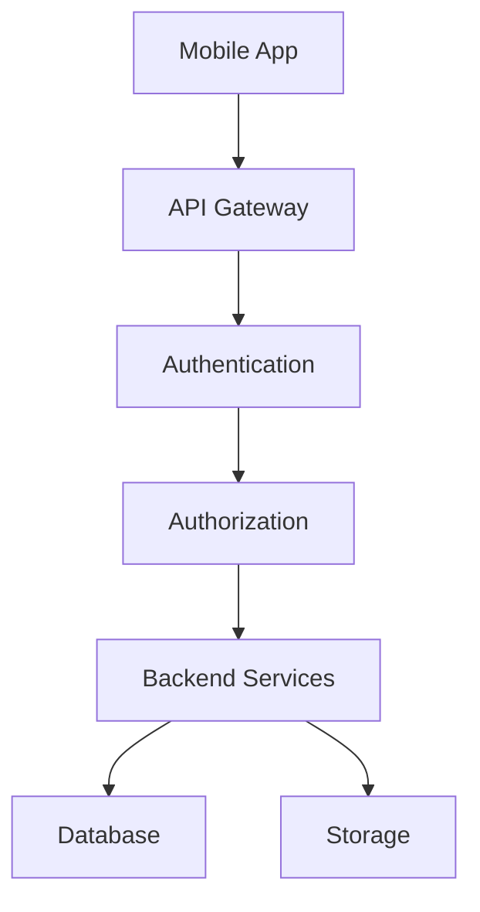
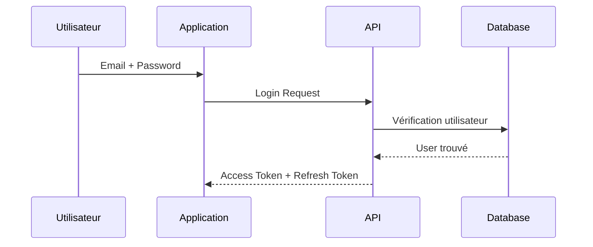

# 🔐 SECURITY_ARCHITECTURE.md

# Uber's Clap

> Architecture sécurité de l'application

Version : 0.1.0

---

# 📖 Introduction

Uber's Clap manipule des données sensibles :

- informations personnelles clients
- informations professionnelles chauffeurs
- factures
- documents signés
- données financières

La sécurité est donc un élément critique du projet.

L'objectif est de construire une application fiable répondant aux standards d'une application SaaS professionnelle.

---

# 🎯 Objectifs sécurité

Le système doit garantir :

✅ Confidentialité des données

✅ Intégrité des informations

✅ Disponibilité du service

✅ Protection contre les attaques

✅ Respect RGPD

---

# 🏗️ Architecture sécurité globale



---

# 🔑 Authentification

## Objectif

Identifier chaque utilisateur de manière sécurisée.

---

# Technologie

Recommandation :

```
JWT + Refresh Token
```

---

# Flux connexion



---

# Access Token

Utilisation :

Accès API quotidien.

Durée recommandée :

```
15 minutes
```

---

Contient :

```json
{
  "userId": "uuid",
  "role": "DRIVER"
}
```

---

# Refresh Token

Objectif :

Renouveler automatiquement la session.

Durée :

```
30 jours
```

---

Stockage :

Mobile :

- Secure Storage
- Keychain iOS
- Android Keystore

---

# 🔒 Gestion mots de passe

Les mots de passe ne sont jamais stockés en clair.

---

Hash recommandé :

```
Argon2id
```

Alternative :

```
bcrypt
```

---

Exemple :

```
Password

↓

Argon2

↓

Hash Database

```

---

# 🛡️ Autorisation

L'authentification répond :

"Qui es-tu ?"

L'autorisation répond :

"Qu'as-tu le droit de faire ?"

---

# RBAC

(Role Based Access Control)

---

Rôles :

```
DRIVER

MANAGER

ADMIN

```

---

Exemple :

Un chauffeur peut :

✅ Voir ses clients

✅ Créer ses courses

❌ Voir les clients d'un autre chauffeur

---

# 🔐 Isolation des données

Principe :

Chaque utilisateur possède son espace.

---

Exemple :

Requête :

```sql
SELECT *
FROM courses
WHERE driver_id = current_user
```

---

Interdit :

```sql
SELECT *
FROM courses
```

---

# 🗄️ Sécurité base de données

---

Mesures :

- UUID public
- requêtes préparées
- ORM sécurisé
- migrations contrôlées
- sauvegardes automatiques

---

# Protection SQL Injection

Utiliser :

- TypeORM
- Prisma
- paramètres préparés

---

Interdit :

```ts
query("SELECT * FROM users WHERE id=" + id);
```

---

# 📡 Sécurité API

---

# HTTPS obligatoire

Toutes les communications :

```
TLS 1.3
```

---

# Validation entrées

Toutes les données reçues doivent être validées.

---

Exemple :

Création client :

```json
{
  "name": "",
  "phone": "invalid"
}
```

↓

Refus API

---

Technologies :

- DTO
- class-validator
- Zod

---

# Rate Limiting

Protection contre :

- spam
- brute force
- abus API

---

Exemple :

Login :

```
5 tentatives / minute
```

---

# CORS

Limiter les domaines autorisés.

---

# Headers sécurité

Ajouter :

- Helmet.js
- Content Security Policy

---

# 📱 Sécurité Mobile

---

# Stockage local

Ne jamais stocker :

❌ Token brut

❌ Données sensibles

---

Utiliser :

- Secure Storage
- Keychain
- Keystore

---

# Mode hors-ligne

Les données locales doivent être :

- chiffrées
- limitées
- synchronisées proprement

---

# 📄 Sécurité fichiers

Documents :

- factures
- signatures
- justificatifs

---

Stockage :

- AWS S3
- Cloudflare R2
- Supabase Storage

---

Règles :

- URLs temporaires
- permissions privées
- contrôle accès

---

Exemple :

Mauvais :

```
bucket/public/facture.pdf
```

---

Correct :

```
signed-url-expiration-5min
```

---

# ✍️ Signature électronique

La signature client doit garantir :

- identité
- date
- intégrité document

---

Stocker :

- image signature
- timestamp
- hash document

---

# 🔔 Sécurité notifications

Ne jamais envoyer :

❌ Informations sensibles complètes

---

Mauvais :

```
Votre client Jean Dupont habite 12 rue...
```

---

Correct :

```
Nouvelle course prévue à 15h
```

---

# 🤖 Sécurité IA

Les données envoyées aux modèles IA doivent être contrôlées.

---

Ne jamais envoyer :

- mots de passe
- tokens
- données bancaires

---

Protection :

- anonymisation
- filtrage données
- logs contrôlés

---

# 💳 Sécurité paiement

Stripe gère :

- données bancaires
- conformité PCI DSS

---

Uber's Clap ne stocke jamais :

❌ Numéro carte

❌ Cryptogramme

---

Stocker uniquement :

- ID client Stripe
- statut abonnement

---

# 🇪🇺 RGPD

Uber's Clap doit respecter :

---

# Droit accès

Utilisateur peut récupérer :

- ses données
- historique

---

# Droit suppression

Utilisateur peut demander :

- suppression compte
- suppression données

---

# Droit modification

Modifier :

- profil
- informations personnelles

---

# Consentement

Avant :

- contacts téléphone
- GPS
- notifications

Demander permission.

---

# Journalisation sécurité

Créer des logs pour :

- connexions
- modifications importantes
- actions administratives

---

Exemple :

```
USER_LOGIN

COURSE_DELETED

INVOICE_CREATED

```

---

# Audit Logs

Table :

```
audit_logs
```

---

Structure :

```sql
id UUID

user_id UUID

action VARCHAR

entity VARCHAR

entity_id UUID

timestamp TIMESTAMP

ip_address VARCHAR

```

---

# Sauvegardes

Database :

Fréquence :

```
quotidienne
```

---

Conserver :

```
30 jours minimum
```

---

Tester régulièrement :

- restauration backup
- récupération données

---

# 🚨 Gestion incidents

En cas de problème :

1. Détection

2. Isolation

3. Analyse

4. Correction

5. Communication utilisateur

---

# Monitoring sécurité

Outils possibles :

- Sentry
- Datadog
- Grafana
- Prometheus

---

# Checklist sécurité avant production

---

## Backend

✅ HTTPS

✅ Validation DTO

✅ Rate limiting

✅ Logs

✅ JWT sécurisé

---

## Mobile

✅ Secure Storage

✅ Permissions natives

✅ Protection données locales

---

## Base

✅ Backup

✅ Encryption

✅ Isolation utilisateurs

---

## RGPD

✅ Politique confidentialité

✅ Suppression données

✅ Export données

---

# 🚀 Évolutions futures

---

# Auth biométrique

Ajouter :

- Face ID
- Touch ID
- empreinte Android

---

# MFA

Authentification double facteur.

---

# Détection fraude

IA pour détecter :

- comptes suspects
- comportements anormaux

---

# Conclusion

La sécurité d'Uber's Clap doit être pensée dès la conception.

L'objectif est de fournir aux chauffeurs une plateforme professionnelle capable de protéger leurs données, celles de leurs clients et leur activité commerciale.
