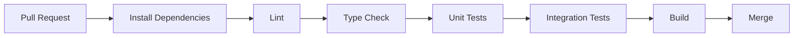

# 🧪 TESTING.md

# Uber's Clap

> Stratégie de tests et assurance qualité

Version : 0.1.0

---

# 📖 Introduction

La qualité est un élément essentiel pour Uber's Clap.

L'application étant utilisée quotidiennement par des chauffeurs professionnels, les erreurs peuvent avoir un impact direct :

- perte d'une course
- erreur de facturation
- problème client
- perte financière

Le projet adopte une stratégie de tests complète.

---

# 🎯 Objectifs

Les tests doivent garantir :

- stabilité de l'application
- fiabilité des données
- sécurité
- absence de régression
- qualité des nouvelles fonctionnalités

---

# 🏗️ Stratégie globale

Le projet suit une approche en plusieurs niveaux :

```
          E2E Tests

       Integration Tests

      Unit Tests

Static Analysis
```

---

# 🧩 Types de tests

---

# 1. Tests unitaires

## Objectif

Tester une fonctionnalité isolée.

---

Exemples :

- calcul du prix d'une course
- validation d'une facture
- calcul rentabilité
- changement statut course

---

# Backend

Outils :

- Jest
- Testing Library

---

Exemple :

```ts
describe("CourseService", () => {
  it("should calculate course price", () => {});
});
```

---

# Mobile

Tester :

- composants
- hooks
- fonctions utilitaires

---

Outils :

- Jest
- React Native Testing Library

---

# 2. Tests d'intégration

## Objectif

Tester plusieurs éléments ensemble.

---

Exemples :

Créer une course :

```
API

↓

Service

↓

Database

```

---

Tests :

- création client
- création course
- génération facture
- authentification

---

# Backend

Tester :

- controllers
- services
- database

---

# 3. Tests End-To-End

## Objectif

Simuler un vrai utilisateur.

---

Exemple :

Un chauffeur :

1. ouvre l'application
2. se connecte
3. crée un client
4. crée une course
5. termine la course
6. génère une facture

---

# Mobile E2E

Outils possibles :

- Maestro
- Detox

---

# Parcours critiques à tester

---

# Authentification

Scénario :

```
Créer compte

↓

Connexion

↓

Accès dashboard

```

---

# Création course

Scénario :

```
Choisir client

↓

Entrer trajet

↓

Ajouter prix

↓

Sauvegarder

```

---

# Facturation

Scénario :

```
Course terminée

↓

Créer facture

↓

Exporter PDF

```

---

# Signature

Scénario :

```
Client signe

↓

Signature sauvegardée

↓

Document généré

```

---

# 🔐 Tests sécurité

---

# Auth

Tester :

- mauvais mot de passe
- token expiré
- refresh token invalide

---

# Permissions

Tester :

Un chauffeur ne peut pas accéder :

```
aux données d'un autre chauffeur
```

---

# API Security

Tester :

- injection SQL
- payload invalide
- spam requêtes

---

# 📱 Tests Mobile spécifiques

---

# Compatibilité appareils

Tester :

Android :

- différentes tailles écran
- versions Android récentes

iOS :

- différentes tailles iPhone

---

# Fonctionnalités natives

Tester :

## GPS

- permission acceptée
- permission refusée

---

## Contacts

- import contacts
- refus permission

---

## Notifications

- réception
- ouverture notification

---

## Signature

- tactile
- sauvegarde image

---

# 🌐 Tests API

Chaque endpoint doit avoir :

- test succès
- test erreur
- test permission

---

Exemple :

POST /courses

Cas :

✅ données valides

❌ client inexistant

❌ date invalide

❌ utilisateur non connecté

---

# 📊 Tests performance

Objectif :

Garantir une bonne expérience.

---

Tester :

- temps réponse API
- charge utilisateurs
- génération PDF
- recherche clients

---

# Outils possibles

- k6
- Artillery

---

# 🧹 Qualité code automatique

À chaque Pull Request :

---

# Lint

Vérification style.

```
npm run lint
```

---

# Type checking

```
npm run typecheck
```

---

# Tests

```
npm run test
```

---

# Build

Vérification compilation.

---

# 🔄 CI/CD Testing Pipeline



---

# 🐛 Gestion des bugs

Chaque bug doit contenir :

---

## Description

Exemple :

"La facture PDF ne se génère pas."

---

## Reproduction

Étapes précises.

---

## Résultat attendu

Ce qui devrait arriver.

---

## Résultat actuel

Ce qui arrive réellement.

---

## Priorité

```
Critical

High

Medium

Low
```

---

# 📌 Critères qualité avant production

Avant chaque release :

---

## Backend

✅ Tests passent

✅ API documentée

✅ Sécurité vérifiée

---

## Mobile

✅ Android testé

✅ iOS testé

✅ Crash-free

---

## Produit

✅ Parcours principal fonctionnel

✅ Feedback utilisateur validé

---

# 📈 Suivi qualité production

Après lancement :

Mesurer :

- crash rate
- erreurs API
- temps réponse
- avis utilisateurs

---

Outils :

- Sentry
- PostHog
- Analytics Store

---

# Conclusion

La stratégie de tests d'Uber's Clap permet de construire une application fiable et professionnelle.

Les tests ne sont pas uniquement une étape finale : ils font partie du développement quotidien afin de garantir une expérience stable aux chauffeurs.
