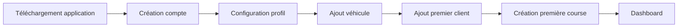
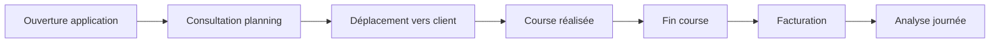
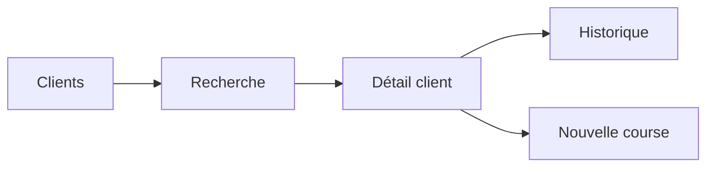
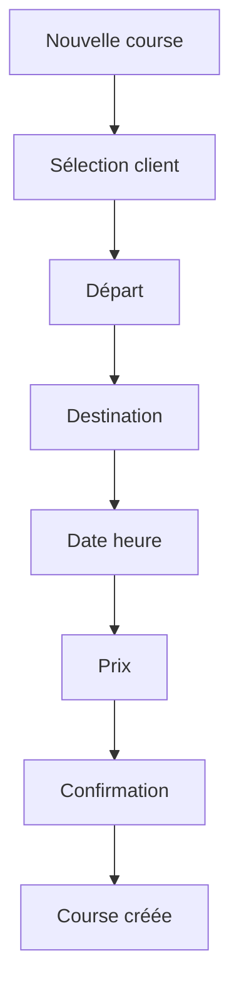
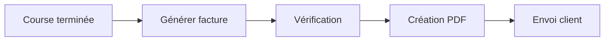
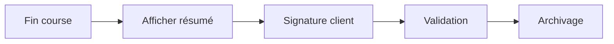
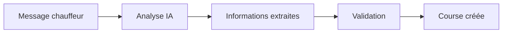

# 📱 USER_FLOW.md

# Uber's Clap

> Parcours utilisateurs et flux fonctionnels

Version : 0.1.0

---

# 📖 Introduction

Ce document présente les principaux parcours utilisateurs d'Uber's Clap.

L'objectif est de définir comment un chauffeur utilise l'application au quotidien.

Le parcours doit être :

- rapide
- intuitif
- adapté à une utilisation en déplacement
- réalisable avec un minimum d'actions

---

# 👤 Parcours 1 — Première utilisation

## Objectif

Permettre au chauffeur de configurer rapidement son espace.

---



---

# Étape 1 — Création compte

L'utilisateur renseigne :

- Nom
- Prénom
- Email
- Téléphone
- Mot de passe

---

Résultat :

Compte créé.

---

# Étape 2 — Configuration profil

Informations :

- Nom professionnel
- Société
- Logo
- Adresse
- Informations facture

---

Objectif :

Préparer automatiquement les documents.

---

# Étape 3 — Ajout véhicule

Informations :

- Marque
- Modèle
- Immatriculation

---

Option :

Ignorer cette étape.

---

# Étape 4 — Création premier client

L'application propose :

"Ajoutez votre premier client."

---

Actions :

- Ajouter manuellement
- Importer contacts

---

# Étape 5 — Création première course

L'utilisateur découvre :

- sélection client
- trajet
- horaire
- prix

---

# Résultat

Arrivée sur dashboard.

---

# 🏠 Parcours 2 — Utilisation quotidienne

## Objectif

Décrire une journée classique.

---



---

# Matin

Le chauffeur ouvre l'application.

Dashboard :

```
Aujourd'hui

🚗 8 courses

💰 620€

📍 230 km

Prochaine course :
08:30 Gare Lyon
```

---

# Avant une course

Le chauffeur consulte :

- heure
- client
- adresse
- notes

---

# Pendant la course

Actions rapides :

- Démarrer course
- Navigation GPS
- Appeler client

---

# Après la course

Le chauffeur :

1. Termine la course
2. Confirme prix final
3. Génère facture

---

# Fin journée

Résumé :

```
Résumé journée

Courses :
8

Chiffre affaires :
620€

Dépenses :
85€

Bénéfice :
535€

```

---

# 👥 Parcours 3 — Gestion d'un client

## Objectif

Créer et retrouver rapidement un client.

---



---

# Liste clients

Fonctionnalités :

- recherche
- filtres
- favoris

---

# Détail client

Afficher :

- coordonnées
- courses passées
- factures
- notes

---

# Création course depuis client

Bouton :

```
+ Nouvelle course
```

Les informations client sont déjà remplies.

---

# 🚗 Parcours 4 — Création d'une course

## Objectif

Créer une réservation rapidement.

---



---

# Étape 1

Choisir :

- client existant
- nouveau client

---

# Étape 2

Ajouter trajet :

- départ
- destination

---

# Étape 3

Ajouter :

- date
- heure

---

# Étape 4

Ajouter :

- prix
- options

---

# Résultat

Course ajoutée au planning.

---

# 🧾 Parcours 5 — Génération facture

## Objectif

Transformer une prestation en document professionnel.

---



---

# Informations facture

Automatiquement :

- chauffeur
- client
- trajet
- date
- montant

---

# Actions

- Télécharger PDF
- Partager
- Envoyer email

---

# ✍️ Parcours 6 — Signature client

(Future version)

---



---

# 🤖 Parcours 7 — Création avec IA

(Future version)

---



---

# Exemple :

Message :

```
Demain 10h récupérer Martin à Orly
vers hôtel Plaza
```

---

Résultat :

```
Client :
Martin

Départ :
Orly

Destination :
Hôtel Plaza

Heure :
10h

Créer ?
```

---

# 🔔 Parcours 8 — Notification rappel

---

Système :

```
24h avant

↓

Notification chauffeur

↓

Rappel client

↓

Course
```

---

# 🚨 Gestion des erreurs utilisateur

---

# Course sans client

Message :

"Veuillez sélectionner un client."

---

# Course sans horaire

Message :

"Veuillez définir une date et une heure."

---

# Conflit planning

Message :

"Cette course chevauche une autre réservation."

---

# 📌 Principes UX

---

# Rapidité

Les actions fréquentes doivent nécessiter peu de clics.

---

Exemple :

Créer une course :

Objectif :

```
< 30 secondes
```

---

# Priorité informationnelle

Toujours afficher :

1. Heure
2. Client
3. Lieu
4. Action suivante

---

# Mobile First

Utilisation :

- une main
- en déplacement
- conditions réelles chauffeur

---

# Conclusion

Les parcours Uber's Clap sont conçus autour du quotidien réel d'un chauffeur VTC.

L'application doit devenir un réflexe quotidien permettant de gérer l'activité avec simplicité et efficacité.
